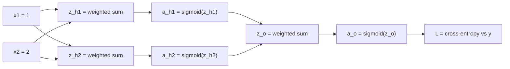

- Why is there no deadlock in the order of corrections?
- Why is this cheap enough to do for billions of parameters?
- What is PyTorch's autograd doing when you call `loss.backward()`?

---

## 1. What you will learn

- The shape of a fully-connected (dense) network and what "fully-connected" means.
- How to forward a single training example through every operation, by hand.
- The backward pass as a message-passing process, with the exact algebra at each edge.
- The recursion that lets you go from 2 layers to 100 layers.
- Why nothing breaks due to ordering — the backward pass *computes* gradients; it does not *apply* updates.
- Why backprop costs about one extra forward pass, not one forward pass per parameter.
- A pseudocode implementation of the whole algorithm.
- What an autograd engine records, and how `loss.backward()` / `optimizer.step()` / `optimizer.zero_grad()` map onto what we do by hand.

---

## 2. The network we are going to train

Logistic regression is a single layer: input → weighted sum → sigmoid → probability. Its decision boundary is a line (or hyperplane). There is a famous class of problems it cannot solve — XOR is the classic example — where no single line separates the two classes.

> Its because both y=0,1 are aligned on diagonal lines, and a single line cannot separate them.

```
x₂
 ↑
 1     ● 1          ● 0
       (0,1)        (1,1)


 0     ● 0          ● 1
       (0,0)        (1,0)

       ───────────────────→ x₁
             0      1
```

One hidden layer fixes this. Here is the network we will use:

- **Input layer**: 2 inputs, $x_1$ and $x_2$.
- **Hidden layer**: 2 neurons, $h_1$ and $h_2$. Each computes a weighted sum of the inputs, adds a bias, applies sigmoid.
- **Output layer**: 1 neuron, $o$. It computes a weighted sum of the *hidden activations*, adds a bias, applies sigmoid to produce a probability.
- **Loss**: binary cross-entropy against the true label $y$.

"Fully-connected" means exactly what it sounds like: every neuron in a layer receives *every* value coming out of the previous layer. There are no missing edges.



Every arrow is one weight (the biases also enter the sum nodes, but we'll draw them in the formulas to keep the picture clean).

Here are the initial values of every parameter. These are arbitrary small numbers — in practice they are initialized randomly near zero:

| Parameter | Value | Interpretation |
|---|---|---|
| $w_{h_1,1}$ | 0.5 | strength of edge $x_1 \to h_1$ |
| $w_{h_1,2}$ | 0.5 | strength of edge $x_2 \to h_1$ |
| $b_{h_1}$ | 0 | bias of hidden neuron 1 |
| $w_{h_2,1}$ | 1 | strength of edge $x_1 \to h_2$ |
| $w_{h_2,2}$ | −1 | strength of edge $x_2 \to h_2$ |
| $b_{h_2}$ | 2 | bias of hidden neuron 2 |
| $w_{o,1}$ | 0.5 | strength of edge $a_{h_1} \to o$ |
| $w_{o,2}$ | 1 | strength of edge $a_{h_2} \to o$ |
| $b_{o}$ | 0 | bias of output neuron |

That is **9 parameters** (6 weights + 3 biases). Training means nudging all 9 until the network predicts well.

Our single training example:

$$
x_1 = 1, \qquad x_2 = 2, \qquad y = 0
$$

The true label is 0, so a good network should output $a_o$ close to 0.

---

## 3. The forward pass, computed completely

Before any gradient talk: we evaluate the network end to end. Every node just does its simple local computation, left to right.

### 3.1 Hidden neuron 1

$$
z_{h_1} = w_{h_1,1} x_1 + w_{h_1,2} x_2 + b_{h_1}
= 0.5 \cdot 1 + 0.5 \cdot 2 + 0
= 0.5 + 1.0
= 1.5
$$

$$
a_{h_1} = \sigma(1.5) = \frac{1}{1 + e^{-1.5}} \approx 0.8176
$$

### 3.2 Hidden neuron 2

$$
z_{h_2} = w_{h_2,1} x_1 + w_{h_2,2} x_2 + b_{h_2}
= 1 \cdot 1 + (-1) \cdot 2 + 2
= 1 - 2 + 2
= 1.0
$$

$$
a_{h_2} = \sigma(1.0) = \frac{1}{1 + e^{-1}} \approx 0.7311
$$

Note what just happened: $h_1$ and $h_2$ consumed the *same* inputs, but computed *different* functions of them. $h_1$ fires (0.82) when both inputs are moderately large; $h_2$ fires (0.73) when $x_2$ is *small* relative to $x_1$ (because of the negative weight). This is the whole power of a hidden layer: it can carve the input space into multiple regions, one per neuron, and the boundary between the classes no longer needs to be a single line.

> Note that the final decision boundary is still a continuous curve which can be traced. But because it goes through a series of linear and non-linear transformations, it can bend and twist in ways that a single line cannot.
> 
> $x$ $\rightarrow$ $\text{linear}$ $\rightarrow$ $\text{nonlinear}$ $\rightarrow$ $\text{linear}$ $\rightarrow$ $\text{nonlinear}$ $\rightarrow$ $\text{output}$
> 
> The final prediction function can be still be expressed as a single function
> 
$$
f(x_1, x_2) = \sigma\left(w_o \cdot \sigma\left(w_{h_1} x_1 + w_{h_2} x_2 + b_{h_1}\right) + b_o\right)
$$

### 3.3 Output neuron

The output neuron does not see the raw inputs. It sees only the two hidden activations:

$$
z_o = w_{o,1} a_{h_1} + w_{o,2} a_{h_2} + b_o
= 0.5 \cdot 0.8176 + 1 \cdot 0.7311 + 0
= 0.4088 + 0.7311
= 1.1399
$$

$$
a_o = \sigma(1.1399) \approx 0.7577
$$

The network predicts $P(y=1 \mid x) \approx 0.76$. The true label is $y = 0$. The network is confidently wrong.

### 3.4 Loss

$$
L(a_o, y) = -\big[ y \log a_o + (1 - y) \log (1 - a_o) \big]
$$

With $y = 0$:

$$
L = -\log(1 - a_o) = -\log(0.2423) \approx 1.4177
$$

### 3.5 Everything we computed, and why we must keep it

Here is the full table of forward quantities. **Do not throw these away** — every one of them will be needed in the backward pass. This is the single most important bookkeeping insight of the entire algorithm:

| Quantity | Value | Computed from |
|---|---|---|
| $z_{h_1}$ | 1.5000 | inputs and hidden weights |
| $a_{h_1}$ | 0.8176 | sigmoid of $z_{h_1}$ |
| $z_{h_2}$ | 1.0000 | inputs and hidden weights |
| $a_{h_2}$ | 0.7311 | sigmoid of $z_{h_2}$ |
| $z_o$ | 1.1399 | hidden activations and output weights |
| $a_o$ | 0.7577 | sigmoid of $z_o$ |
| $L$ | 1.4177 | $a_o$ and the true label |

You will see shortly that the backward pass asks, at every multiplication node, "what was the other input?" (because $\partial(a \cdot b)/\partial a = b$). The values above are exactly those answers, already cached.

---

## 4. Before gradients: what would the "ideal hidden activations" be?

Pause and think about what the output layer would *like*.

The prediction sits at $a_o = 0.76$, but we want $0$. The output layer has only two kinds of knobs:

1. **Its own weights and bias** ($w_{o,1}, w_{o,2}, b_o$) — these scale and shift the weighted sum that produces $z_o$.
2. **Its inputs** ($a_{h_1}, a_{h_2}$) — but these don't belong to it. They are *reports* produced by the hidden layer, which has its own weights.

This is a real tension. If the output layer retunes its own weights to make the current inputs produce $0$, and then the hidden layer changes *its* weights, the hidden activations change, and the output layer's retuning is now mis-calibrated. If the hidden layer retunes using messages based on the output layer's *current* weights, and then the output layer changes its weights, the hidden layer's retuning is stale.

It looks like a deadlock. Which layer moves first? Who tells whom what?

**The resolution has two parts, and both are crucial:**

1. **The backward pass makes no changes at all.** It only *computes* gradients — hypothetical "what-if" measurements — using the values of one frozen forward pass. While measuring, nobody moves.
2. **After all measurements are complete, every parameter moves simultaneously**, by a small amount, in its own negative-gradient direction. Then a fresh forward pass is run, fresh measurements are taken against the new frozen state, and only then do parameters move again.

The reason this is not contradictory: each gradient is a *first-order approximation* — valid only for infinitesimal changes around the frozen state. The learning rate keeps every step small enough that changes in other layers don't invalidate the messages much, and each training step recomputes everything from scratch so errors never accumulate.

With this picture in mind, the backward pass is: *each layer computes its own weight updates AND computes what it wishes its inputs had been, expressed as derivatives.* The backward pass is finished when every parameter knows its gradient.

> This paragraph clarified the key insight: even with many parameters ($w_{h_1,1}, w_{h_1,2}, \ldots, w_{o,1}, w_{o,2}$), the algorithm is straightforward. First, compute all gradients ($\partial L/\partial w_o, \partial L/\partial b_o, \ldots, \partial L/\partial w_{h_1,1}$) using the frozen forward pass. Then, update each parameter simultaneously: $w_{o,1} \leftarrow w_{o,1} - \alpha \cdot \partial L/\partial w_{o,1}$, and likewise for all others. No layer moves before the other; all gradients are measured first, then all parameters shift at once.

> If we compare the training loop for linear/logistic regression with NN's, it appears exactly same

```
1. Initialize parameters

2. Forward pass
   → evaluate the model
   → calculate the loss

3. Backward pass
   → compute ∂L/∂parameter for EVERY parameter
   → using the exact parameter state from step 2

4. Update ALL parameters
   parameter ← parameter - α × gradient

5. Repeat from step 2
```

> The difference here in implementation is we don't differentiate the giant loss function in one shot, but peel it layer by layer

---

## 5. Backward pass, stage 1: the loss node speaks

The loss was computed as

$$
L = -\big[ y a_o \text{-term} \ldots\big] = -\big[ y \log a_o + (1-y) \log (1 - a_o) \big]
$$

The first backward question: **how sensitive is the loss to the output activation?** That is $\partial L / \partial a_o$. Deriving, with no steps skipped:

$$
\frac{\partial L}{\partial a_o} = \frac{\partial}{\partial a_o} \Big[ -y \log a_o - (1-y) \log(1 - a_o) \Big]
$$

Differentiate each term separately ($y$ is a constant here — the data, not a parameter):

$$
\frac{\partial}{\partial a_o} \big[ -y \log a_o \big] = -\frac{y}{a_o}
$$

$$
\frac{\partial}{\partial a_o} \big[ -(1-y) \log(1 - a_o) \big] = -(1-y) \cdot \frac{1}{1-a_o} \cdot (-1) = \frac{1-y}{1-a_o}
$$

(The two $(-1)$ factors in the second term: one from the chain rule derivative of $1-a_o$, one from the outer minus.)

Adding:

$$
\frac{\partial L}{\partial a_o} = -\frac{y}{a_o} + \frac{1-y}{1-a_o}
$$

Get a common denominator $a_o(1-a_o)$:

$$
= \frac{-y(1-a_o) + (1-y)a_o}{a_o(1-a_o)}
= \frac{-y + y a_o + a_o - y a_o}{a_o(1-a_o)}
= \frac{a_o - y}{a_o(1-a_o)}
$$

With our numbers ($a_o = 0.7577$, $y = 0$):

$$
\frac{\partial L}{\partial a_o} = \frac{-0}{0.7577} + \frac{1}{0.2423} \approx 4.1265
$$

Sanity-check the sign. The label is 0, so we want $a_o$ *small*. $\partial L / \partial a_o = +4.13$ says "increasing $a_o$ *increases* the loss" — so to reduce the loss we must *decrease* $a_o$. Good, consistent.

---

## 6. Backward pass, stage 2: through the output sigmoid

The output activation is $a_o = \sigma(z_o)$. We need $\partial L / \partial z_o$, which asks: how does the loss respond to the pre-activation sum?

Chain rule:

$$
\frac{\partial L}{\partial z_o} = \frac{\partial L}{\partial a_o} \cdot \frac{\partial a_o}{\partial z_o}
$$

The second factor is the sigmoid derivative. One fact, derived once and reused forever:

**Sigmoid derivative.** $\sigma(z) = 1/(1+e^{-z})$. Then

$$
\sigma'(z) = \frac{d}{dz} \big(1+e^{-z}\big)^{-1} = \frac{e^{-z}}{(1+e^{-z})^2} = \frac{1}{1+e^{-z}} \cdot \frac{e^{-z}}{1+e^{-z}}
= \sigma(z)\,\big(1 - \sigma(z)\big)
$$

So:

$$
\frac{\partial a_o}{\partial z_o} = a_o (1 - a_o)
$$

Now multiply the two factors. Because $\partial L / \partial a_o = (a_o - y) / \big(a_o(1-a_o)\big)$, the denominators cancel:

$$
\frac{\partial L}{\partial z_o} = \frac{a_o - y}{a_o(1-a_o)} \cdot a_o(1-a_o) = a_o - y
$$

This is the compact result from the logistic regression note: the gradient arriving at the pre-sigmoid node is simply *prediction minus target*.

$$
\underbrace{\delta_o}_{\text{"error signal" at } z_o} = a_o - y = 0.7577 - 0 = 0.7577
$$

Call $\delta_o$ the **error signal** at the output neuron's pre-activation. It answers: "if $z_o$ went up by 1, the loss would go up by about 0.7577."

---

## 7. Backward pass, stage 3: splitting the error signal across output weights

Now the weighted-sum node. Recall:

$$
z_o = w_{o,1} a_{h_1} + w_{o,2} a_{h_2} + b_o
$$

This node defines $z_o$ from four inputs. It needs to compute four things: the gradient of $L$ with respect to each input. Watching a sum node is easy: the sensitivity arriving at $z_o$ (which is $\delta_o$) flows back *unchanged* to each summand, and multiplying by each summand's dependence on $z_o$ — which is just the factor it multiplies by — gives the final answer.

For the output-layer parameters:

$$
\frac{\partial L}{\partial w_{o,1}} = \delta_o \cdot \underbrace{\frac{\partial z_o}{\partial w_{o,1}}}_{= \, a_{h_1}} = 0.7577 \cdot 0.8176 \approx 0.6195
$$

$$
\frac{\partial L}{\partial w_{o,2}} = \delta_o \cdot \underbrace{\frac{\partial z_o}{\partial w_{o,2}}}_{= \, a_{h_2}} = 0.7577 \cdot 0.7311 \approx 0.5540
$$

$$
\frac{\partial L}{\partial b_o} = \delta_o \cdot \underbrace{\frac{\partial z_o}{\partial b_o}}_{= \, 1} = 0.7577
$$

Notice the pattern, and notice it explains the logistic-regression gradient at a glance:

> **The gradient with respect to a weight is the error signal at the sum, times the input that weight multiplies.**

$\delta_o$ is "how wrong $z_o$ is" and $a_{h_1}$ is "how much $w_{o,1}$ was listening to" — a weight whose feeding line was inactive gets less blame.

But the sum node also receives two *activation* inputs, $a_{h_1}$ and $a_{h_2}$, and it owes the hidden layer a report about them:

$$
\frac{\partial L}{\partial a_{h_1}} = \delta_o \cdot \frac{\partial z_o}{\partial a_{h_1}} = \delta_o \cdot w_{o,1} = 0.7577 \cdot 0.5 = 0.3789
$$

$$
\frac{\partial L}{\partial a_{h_2}} = \delta_o \cdot \frac{\partial z_o}{\partial a_{h_2}} = \delta_o \cdot w_{o,2} = 0.7577 \cdot 1 = 0.7577
$$

**Read these as a message from the output layer to the hidden layer.** "I would have been less wrong if:

- $a_{h_1}$ were lower (its sensitivity is *positive*, 0.3789; the activation multiplied a positive weight into $z_o$, and we need $z_o$ down). Decreasing $a_{h_1}$ by a tiny $\epsilon$ cuts the loss by about $0.38\,\epsilon$.
- $a_{h_2}$ were a lot lower (sensitivity 0.7577 — about double, because it multiplied the bigger weight 1.0)."

That is the complete "how does a neuron tell the previous layer what went wrong". It tells them with two numbers. Not by instructions, not by target values — by sensitivities. Each hidden neuron now has exactly enough information to figure out how *its own* weights should move, without knowing anything about what the output layer's weights are or what target the network is aiming at. It only needs its local message.

> This is an excellent explanation for someone who wants to know how does a layer propagates the error backwards. Each layer peels off the factors it owns and passes the running product backward. The hidden layer never "hears" from the output layer in any conversational sense — it just receives a number which is the accumulated product of all the derivatives upstream. 
	​
---

## 8. Backward pass, stage 4: through the hidden sigmoid

Each hidden neuron is a copy of the same two-node story: activation backward (sigmoid), then sum backward (weights split).

For $h_1$:

$$
\delta_{h_1} = \frac{\partial L}{\partial z_{h_1}} = \frac{\partial L}{\partial a_{h_1}} \cdot \underbrace{\sigma'(z_{h_1})}_{a_{h_1}(1 - a_{h_1})}
= 0.3789 \cdot (0.8176 \cdot 0.1824)
= 0.3789 \cdot 0.1491
\approx 0.0565
$$

For $h_2$:

$$
\delta_{h_2} = \frac{\partial L}{\partial z_{h_2}} = \frac{\partial L}{\partial a_{h_2}} \cdot \sigma'(z_{h_2})
= 0.7577 \cdot (0.7311 \cdot 0.2689)
= 0.7577 \cdot 0.1966
\approx 0.1490
$$

The error signal shrank by roughly 5–10× through the sigmoids. The factor $\sigma'(z) = a(1-a)$ is at most $0.25$ (at $a = 0.5$) and drops to nearly 0 when a neuron is saturated ($a \approx 0$ or $a \approx 1$). Run this through 20 sigmoid layers and the earliest layers receive error signals like $0.7577 \times 0.15^{20}$ — computationally zero. This is the **vanishing gradient** problem, and it is the deep reason modern networks use ReLU-type activations in hidden layers (whose derivative doesn't shrink) while keeping sigmoid/softmax at the output where its probability interpretation matters.

> We don’t want the gradient to necessarily approach zero. We want it to carry useful information all the way back to the parameters that need changing.


> **What the gradient actually means for a weight**

> The whole point of backprop is that every weight gets a gradient telling it "move this much in this direction." A weight in layer 1 of a 20-layer network still needs a meaningful gradient to learn anything. If its gradient is $10^{-15}$, the update is:

> $$w \leftarrow w - \alpha \times 10^{-15}$$

> That weight essentially doesn't move. The early layers of the network are frozen in place — not by design, but because the error signal dissolved before reaching them. The network is technically "training" but only the last few layers are actually learning.

> **Why sigmoid specifically causes this**
>
> The culprit is this factor at every hidden layer:
>
> $$\sigma'(z) = a(1-a) \leq 0.25$$
>
> It's *always* less than or equal to 0.25. So every time the gradient passes through a sigmoid, it gets multiplied by something ≤ 0.25. Through 20 layers:
>
> $$0.25^{20} \approx 10^{-12}$$
>
> It's not that the gradient *might* shrink — it's *guaranteed* to shrink at every single hidden layer. The sigmoid is structurally a gradient killer.
>
> **What ReLU does differently**
>
> ReLU is defined as:
>
> $$\text{ReLU}(z) = \max(0, z)$$
>
> Its derivative is almost embarrassingly simple:
>
> $$\text{ReLU}'(z) = \begin{cases} 1 & \text{if } z > 0 \\ 0 & \text{if } z < 0 \end{cases}$$
>
> When the neuron is active ($z > 0$), the derivative is exactly 1. Multiplying the gradient by 1 doesn't shrink it at all — the gradient passes through unchanged. Over 20 layers of active ReLU neurons, you don't get $0.25^{20}$, you get $1^{20} = 1$.
>
> **But ReLU has its own problem — dead neurons**
>
> When $z < 0$, the derivative is 0. That neuron contributes *nothing* to the gradient — it's as if it doesn't exist for that pass. If a neuron's weights drift such that it produces negative $z$ for every input in your dataset, it stops learning permanently. Its gradient is always 0, its weights never update, it stays negative forever. This is called a **dead ReLU**.
>
> So you trade one problem for another:
> - Sigmoid: gradient shrinks but never fully dies
> - ReLU: gradient doesn't shrink, but individual neurons can die completely
>
> In practice, dead ReLUs are less catastrophic than vanishing gradients, which is why ReLU became the default. There are also variants like Leaky ReLU (derivative is 0.01 instead of 0 for $z < 0$) and GELU that try to get the best of both.
>
> **The asymmetry the notes hint at — why sigmoid stays at the output**
>
> At the output layer, you *want* sigmoid (or softmax). The reason is interpretability: you need the output to be a valid probability, bounded between 0 and 1. The vanishing gradient problem only bites when the gradient has *many layers left to travel through*. At the output, it has zero layers left — it's already home. So sigmoid's crushing effect on gradient magnitude doesn't matter there; its probability interpretation is all that counts.
---

## 9. Backward pass, stage 5: hidden-layer weights

Same sum-node rule as before, with the hidden error signals and the raw inputs:

$$
\frac{\partial L}{\partial w_{h_1,1}} = \delta_{h_1} \cdot x_1 = 0.0565 \cdot 1 = 0.0565
\qquad
\frac{\partial L}{\partial w_{h_1,2}} = \delta_{h_1} \cdot x_2 = 0.0565 \cdot 2 = 0.1130
$$

$$
\frac{\partial L}{\partial b_{h_1}} = \delta_{h_1} = 0.0565
$$

$$
\frac{\partial L}{\partial w_{h_2,1}} = \delta_{h_2} \cdot x_1 = 0.1490 \cdot 1 = 0.1490
\qquad
\frac{\partial L}{\partial w_{h_2,2}} = \delta_{h_2} \cdot x_2 = 0.1490 \cdot 2 = 0.2980
$$

$$
\frac{\partial L}{\partial b_{h_2}} = \delta_{h_2} = 0.1490
$$

The inputs are fixed data, so the backward pass stops here. Every one of the 9 parameters now has a gradient.

Full ledger:

| Parameter | Gradient | Interpretation |
|---|---|---|
| $w_{o,1}$ | +0.6195 | reducing it trims the positive push from $h_1$ |
| $w_{o,2}$ | +0.5540 | reducing it trims the push from $h_2$ |
| $b_o$ | +0.7577 | biggest knob — shift the whole sum down |
| $w_{h_1,1}$ | +0.0565 | mild downward pressure |
| $w_{h_1,2}$ | +0.1130 | larger — $h_1$ fired on $x_2=2$ |
| $b_{h_1}$ | +0.0565 | mild |
| $w_{h_2,1}$ | +0.1490 | |
| $w_{h_2,2}$ | +0.2980 | most responsible hidden weight — in absolute terms |
| $b_{h_2}$ | +0.1490 | |

---

## 10. One gradient step, taken simultaneously

Now — and only now — does anything update. With learning rate $\alpha = 0.1$, every parameter moves by $-\alpha \cdot \text{(its gradient)}$, using the gradients from the frozen forward pass:

$$
w_{o,1} \leftarrow 0.5 - 0.1 \cdot 0.6195 = 0.4381
$$

$$
w_{o,2} \leftarrow 1 - 0.1 \cdot 0.5540 = 0.9446
$$

$$
w_{h_2,2} \leftarrow -1 - 0.1 \cdot 0.2980 = -1.0298
$$

$$
\ldots \text{ (all 9 parameters move at once)}
$$

Predict what a new forward pass gives, without re-computing everything: $w_{o,2}$ shrank, $w_{h_2,2}$ became more negative (pulling $z_{h_2}$ down, hence $a_{h_2}$ down), $b_o$ dropped by $0.076$. Every change pushes $z_o$ down, hence $a_o$ down — toward the target 0. The messages were consistent, even though each layer only "knew" its own local numbers.

About the deadlock worry directly: the output layer did its correction *in the same atomic step* as the hidden layer, and both corrections were derived from the *same frozen state*. No correction is computed on top of another correction. The hidden layer's update used output-layer weights $w_{o,\cdot}$ exactly as they appeared in this forward pass; on the next forward pass those weights will have moved slightly, but the new messages will be recomputed against the new state. Each step is a fresh measurement. Nothing is stale because nothing is kept.

This is the complete algorithm:

```text
1. forward pass, caching every z and every a
2. δ at the output pre-activation  =  a_out − y
3. weight gradients                =  δ at each z, times the feeding activation
4. error signal for layer L        =  (weights from L to L+1 transposed) × δ of L+1, then × σ′(z of L)
5. repeat 3–4 per layer, moving left
6. update every parameter simultaneously:  p ← p − α·(gradient)
7. recompute step 1 on the (now updated) weights
```

Training loops 1–7 over the dataset — either one example at a time (**SGD**), or on mini-batches where all gradients are averaged over the examples in the batch.

---

## 11. The recursive form (this is the whole of backprop)

Everything above is a per-neuron application of two formulas, repeated per layer. For a layer index $\ell$ with activations $a^{[\ell]}$, pre-activations $z^{[\ell]}$, weights $W^{[\ell]}$ from layer $\ell-1$ to layer $\ell$:

$$
\delta^{[\ell]} = \big(W^{[\ell+1]}\big)^{T}\, \delta^{[\ell+1]} \,\odot\, \sigma'\big(z^{[\ell]}\big)
$$

$$
\nabla_{W^{[\ell]}} L = \delta^{[\ell]} \, \big(a^{[\ell-1]}\big)^{T}, \qquad \nabla_{b^{[\ell]}} L = \delta^{[\ell]}
$$

Stop on the first formula for a moment, it is the heart of the algorithm and deserves to be plain.

- $W^{[\ell+1]}$ is the matrix connecting layer $\ell$ to layer $\ell+1$. Its transpose **reverses the direction of its edges** — a row that said "how much does output $o$ listen to $h_1$" becomes "how much of output-neuron $o$'s error should be attributed back to $h_1$".
- $\delta^{[\ell+1]}$ are the error signals already computed one layer deeper.
- $\odot$ is elementwise multiplication — each neuron multiplies by its *own* activation slope $\sigma'(z)$.

So the transcription into words is: *"my error signal = (how much everyone downstream blames me) × (how responsive I currently am)."*

Check it against our numbers to make sure the shorthand isn't hiding anything:

$$
\big(W^{[\text{out}]}\big)^{T} \delta_o =
\begin{bmatrix} 0.5 \\ 1 \end{bmatrix} \cdot 0.7577 =
\begin{bmatrix} 0.3789 \\ 0.7577 \end{bmatrix}
$$

Those two entries are exactly $\partial L / \partial a_{h_1}$ and $\partial L / \partial a_{h_2}$ from step 7. And elementwise multiplying by the sigmoid slopes reproduces $\delta_{h_1}, \delta_{h_2}$ from step 8.

For a 100-layer network of 1000 neurons per layer, the same two formulas apply at each layer. Nobody re-derives anything; the recursion *is* the derivation.

---

## 12. Why backprop is cheap (with numbers)

The obvious alternative to backprop is finite differences: nudge each parameter by $+\epsilon$, re-run the forward pass, and see how much the loss moved.

Our toy net has 9 parameters, so finite differences need about **10 forward passes** (one baseline + one per parameter). A real model has 7 billion parameters — 7 billion forward passes *per training step*. Each forward pass processes an entire batch of data. Clearly infeasible.

Backprop replaces this with **one forward pass + one backward pass**. And the backward pass is roughly as expensive as the forward pass: count operations per edge.

- Forward, each edge does one multiply (and the sum nodes accumulate).
- Backward, the same edge does one multiply for the downstream blame ($\delta \cdot w$) and one multiply for its own weight's gradient ($\delta \cdot a$).

So backward ≈ 2× forward in raw multiply count. Total: about **3 forward-pass equivalents**, no matter how many parameters there are. The saving vs finite differences is a factor proportional to the *number of parameters* — this is why it is even thinkable to train networks with billions of parameters.

What makes this possible is not calculus magic but **caching and reuse**:

- Forward caches every $z$ and $a$ (needed because local derivatives use them: $\partial z/\partial w = a$ on the feeding side, $\sigma'(z) = a(1{-}a)$ at activations).
- Backward computes each $\delta$ **once** and reuses it for every weight feeding that node and every activation flowing from it. Finite differences recomputes the whole network per parameter; backprop computes each intermediate sensitivity once, shared by everything upstream.

> There is nothing fundamentally new here, even in linear regression we update all parameters at once. This is just exploring a hypothetical idea of what if we updated only param per 1 forward + backward pass. 
---

## 13. Pseudocode: the whole thing, layer by layer

Here is the complete algorithm for a dense network with any number of layers, with pointers $W^{[\ell]}, b^{[\ell]}$, activations $a^{[\ell]}$, and cached pre-activations $z^{[\ell]}$. $f$ is the hidden-layer activation (sigmoid here), and `sigma_prime` returns $\sigma'(z)$.

```text
forward_pass(x):
    a[0] = x
    for l = 1 ... L:
        z[l] = W[l] @ a[l-1] + b[l]
        a[l] = f(z[l])                 # sigmoid here
        cache z[l], a[l]
    return a[L]

backward_pass(a[L], y):
    # error at the output pre-activation; derived for BCE + sigmoid
    delta[L] = a[L] - y

    grad_W[L] = delta[L] ⊗ a[L-1]      # outer product
    grad_b[L] = delta[L]

    for l = L-1 down to 1:
        delta[l] = (W[l+1]^T @ delta[l+1]) * sigma_prime(z[l])
        grad_W[l] = delta[l] ⊗ a[l-1]
        grad_b[l] = delta[l]

update(alpha):
    for l = 1 ... L:
        W[l] -= alpha * grad_W[l]      # all after backward is done
        b[l] -= alpha * grad_b[l]
```

For a mini-batch of size $m$, average every `grad_W[l]`, `grad_b[l]` over the batch before updating — same formulas, just means instead of single examples.

Everything earlier — the deadlock discussion, the message-passing picture — is visible here in code form: `backward_pass` only writes into `grad_*` buffers; `update` runs strictly afterward, and `forward_pass` runs strictly before.

---

## 14. What autograd does

By hand or by code, the computation above never changes. What an autograd engine (PyTorch's, JAX's, TensorFlow's) does is **build the graph while your forward code runs**, and then walk it backward when you ask.

For every arithmetic operation on a tracked quantity, the engine records a node containing:

- the resulting **value**,
- pointers to the **inputs** of the operation,
- a rule for the operation's **local backward step** (e.g. for $u \cdot v$: `u.grad += (upstream) * v`, `v.grad += (upstream) * u`).

Trace what the engine does internally for our hidden sum. Your code writes `z = w1*x1 + w2*x2 + b`. The engine actually builds:

```text
t1 = w1 * x1   →   node t1: value 0.5,   inputs {w1, x1}
t2 = w2 * x2   →   node t2: value 1.0,   inputs {w2, x2}
t3 = t1 + t2   →   node t3: value 1.5,   inputs {t1, t2}
t4 = t3 + b    →   node t4: value 1.5,   inputs {t3, b}        # this is z_h1
t5 = sigmoid(t4) → node t5: value 0.8176, inputs {t4}           # this is a_h1
```

Every other operation in the network gets exactly the same treatment. When you call `loss.backward()`:

1. It seeds the loss node with gradient `1` (that is our $\partial L/\partial L$ convention).
2. It walks the recorded graph in reverse execution order — the exact walk we did by hand in sections 5–9.
3. At each node it applies the local backward rule and **accumulates** into the `.grad` field of each input. Accumulation handles branching automatically (the multi-path addition rule from the graph series).

The three calls you see in every PyTorch training loop map directly onto section 13:

```python
optimizer.zero_grad()   # clear last step's message buffers (they ACCUMULATE by default,
                        #  which is useful for accumulating gradients across mini-batches)
loss.backward()         # backward_pass: fills .grad for every leaf parameter
optimizer.step()        # update: p -= lr * p.grad, for every parameter at once
```

Nothing is hidden: `.grad` for `w_h2_2` after one backward pass of our example would contain `0.2980` — the same number you computed on paper in section 9.

Two last distinctions worth keeping sharp, because they're easy to conflate:

- **The graph records nursing of values, not of symbols.** Autograd never holds a big symbolic expression like $L = -\log(1-\sigma(w_{o,1}\sigma(\dots)\dots))$ and differentiates it analytically. It applies the chain rule numerically, once per node, using the actual values in the graph.
- **Backpropagation ≠ gradient descent.** Backprop computes gradients; gradient descent uses them. The first is bookkeeping; the second is the optimization step.

> Autograd doesn't mean merely caching the values of operations during forward pass to use them in backwrd pass.
> 
> It records the intermediate values and the local operations/dependencies so that it can later apply the chain rule efficiently.
>
> During forward, autograd effectively remembers:
>
> ```
> t1 = w1 * x1
> t2 = w2 * x2
> z  = t1 + t2
> a  = sigmoid(z)
> ```
> and the relevant values. Then backward comes along and says:
> ```
> I need ∂L/∂z.
>
> Okay, z came from t1 + t2.
> For addition, derivative is 1.
>
> I need ∂L/∂w1.
>
> Okay, t1 came from w1 * x1.
> Derivative with respect to w1 is x1.
> I already know x1.
>
> I need ∂L/∂x1.
> Derivative with respect to x1 is w1.
> I already know w1.
> ```

---

## 15. Exercises

1. **Repeat the whole backward pass** for the same network with target $y=1$ instead of $y=0$: new $\delta_o$, new messages $\partial L/\partial a_{h_1}, \partial L/\partial a_{h_2}$, new hidden deltas, all 9 parameter gradients. At the end, check the *sign* of each gradient makes sense (things should push $a_o$ up this time).
2. **Finite-difference check.** Using only forward passes, estimate $\partial L/\partial w_{o,1}$ numerically with $\epsilon = 0.001$. Compare to the hand value $0.6195$. Which of your numbers should flip if the error is from rounding rather than the formula?
3. Suppose $w_{o,2}$ were $-1$ instead of $+1$ (nothing else changes). Before touching paper, predict whether the message sent back to $h_2$ would flip sign. Then verify by propagating.
4. In the recursive formula $\delta^{[\ell]} = (W^{[\ell+1]})^T \delta^{[\ell+1]} \odot \sigma'(z^{[\ell]})$, which factor corresponds to "what the next layer wishes I had done differently", and which factor corresponds to "how capable I am of changing"? Why is it natural that they multiply rather than add?

---

## 16. What comes next

The machinery is now complete end-to-end: forward caching, backward messages, simultaneous updates. The next step is the toolchain and realism layer: vectorizing the pseudocode over mini-batches, implementing this same 2-layer network in NumPy first (no autograd), and comparing the hand-computed and autograd gradients for this exact example. Both should produce the gradient table in section 9 — that is a satisfying way to verify an implementation.
