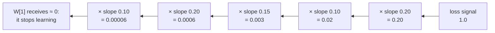

# Activation Functions: Why Sigmoid Fades and ReLU Won

The [previous note](/posts/ml/2026-09-14-1-training-a-2-layer-network-in-numpy) finished with pseudocode for a network of any depth $L$. One line in that pseudocode deserved more attention:

```text
dZ[l-1] = dA[l-1] * activation_derivative(A[l-1])
```

Everything else in the backward pass is matrix multiplication — copying, scaling, and adding error signals. This one line is different: it is the only place where the network's *non-linearity* touches the gradients. The choice of activation function decides whether error signals survive the trip from output back to input, or die on the way.

This note assumes you already understand backprop on dense layers (the previous three notes). We will not re-derive the chain rule. Instead, we will:

- See why depth is useless without nonlinearity.
- Re-examine sigmoid's slope with the numbers from our running example, and see exactly why gradients vanish in deep stacks.
- Meet ReLU, its slope, and do a full numeric comparison on the same network.
- Understand the dead ReLU problem and the leaky fix.
- Get the payoff line: what actually changes in your backward code (almost nothing).
- Separate output activations from hidden activations — they answer different questions.

---

## 1. Why any activity function exists at all

A layer without an activation computes:

$$
Z = A_{\text{prev}} W + b
$$

That is a linear function of its input. Stack two of them:

$$
Z^{[2]} = (X W^{[1]} + b^{[1]}) \, W^{[2]} + b^{[2]} = X (W^{[1]} W^{[2]}) + (b^{[1]} W^{[2]} + b^{[2]})
$$

The two-layer stack is algebraically identical to a single layer with weight matrix $W^{[1]} W^{[2]}$. You made the network deeper and gained nothing. A 100-layer network of pure linear layers is, mathematically, logistic regression wearing a trench coat.

The whole reason depth is useful is that a nonlinear function between layers **breaks this collapse**. Two linear transformations glue together; a linear-nonlinearity-linear stack does not.

So the activation function's job is: *sit between layers and make the stack un-collapsible.* Everything else — the exact shape, the slope, the choice of function — is negotiable. And negotiated it has been: neural networks have been trained with threshold functions, tanh, sigmoid, ReLU, and smooth modern variants, each dominating its era. The rest of this note is about *which* nonlinearity to pick and *why* the current winner is ReLU.

---

## 2. What we actually want from an activation function

Before comparing candidates, list the demands. An activation function should be:

1. **Nonlinear** — otherwise depth collapses, per section 1.
2. **Nonzero slope in most of its domain** — because every backward message gets multiplied by this slope at every layer.
3. **Cheap to compute** — it runs on every neuron, every example, every iteration.
4. **Bounded slope** — a slope much bigger than 1 would amplify gradients (the opposite problem, exploding gradients).

Property 2 is the one that dominates practice, and it is where sigmoid fails. Let us see it concretely.

---

## 3. Sigmoid under the backward-pass microscope

We already know sigmoid from logistic regression:

$$
\sigma(z) = \frac{1}{1 + e^{-z}}
$$

and its slope, derived cleanly in the earlier notes:

$$
\sigma'(z) = \sigma(z) \, (1 - \sigma(z))
$$

Look at what this slope actually is for the values we computed in the last two notes:

| $z$ | $\sigma(z)$ | slope $\sigma'(z)$ |
|---|---|---|
| $-4$ | $0.0180$ | $0.0177$ |
| $-2$ | $0.1192$ | $0.1050$ |
| $-1$ | $0.2689$ | $0.1966$ |
| $0$  | $0.5000$ | $0.2500$ |
| $1$  | $0.7311$ | $0.1966$ |
| $1.5$ | $0.8176$ | $0.1491$ |
| $2$  | $0.8808$ | $0.1050$ |
| $4$  | $0.9820$ | $0.0177$ |

Two observations, both deadly in deep stacks:

**Observation 1: the maximum slope anywhere is 0.25.** Even at the best possible point ($z = 0$, the steepest part of the curve), an error message passing through a sigmoid backward gets cut to a quarter of its size. That is guaranteed shrinkage.

**Observation 2: shrinkage compounds across layers.** The backward pass multiplies by the activation slope at *every layer it passes through*. Our 2-layer network had just one hidden activation, and we already saw the message shrink from 0.7577 to 0.0565 on one neuron. Now imagine a modest 6-layer network. If five of the activation slopes are, optimistically, 0.25 each:

$$
\text{surviving fraction} \leq 0.25^5 \approx 0.00098
$$

A message of size 1 that leaves the final layer arrives at the first layer as less than **0.001**. The first layers of the network — the ones doing the feature extraction — receive gradient signals three orders of magnitude weaker than the last layers. In practice the shrinkage is worse, because the network is rarely sitting at $z = 0$; typical hidden activations push $z$ into the flat tails where the slope is 0.02–0.10.

This is **vanishing gradients**, and for decades it was the wall that stopped people from training deep networks. Early layers stop learning; the network's depth becomes decoration.



---

## 4. ReLU: the activation with a slope of exactly 1

ReLU stands for *rectified linear unit*. Its entire definition is:

$$
f(z) = \max(0, z)
$$

That is all. The forward pass clips negatives to zero and passes positives through untouched. A sketch of its shape:

```text
output
   |
   |        /
   |       /
   |      /
   |     /
   |    /
___|___/________ z
   |
   |   (← zero for all z ≤ 0, then the line y = x)
```

The slope is even simpler. For $z > 0$: slope $= 1$. For $z < 0$: slope $= 0$. (At $z = 0$ the derivative is undefined; implementations arbitrarily use 0. It does not matter — this point has measure zero and floating-point inputs essentially never hit it exactly.)

Now re-run the two observations from section 3 through ReLU:

**Observation 1 revisited: the slope of the active region is 1, always.** An error message passing backward through an active ReLU neuron is **not changed at all**. It passes through intact. No shrinkage, no matter how confident the neuron is — because ReLU has no "confident and saturated" region on the positive side. The concept "saturated" does not exist on the right half; the function is a pure straight line there.

**Observation 2 revisited: shrinkage does not compound.** If a chain of five hidden layers all happen to be active (positive $z$), a message of size 1 at the output arrives at the first layer as... size 1. The depth-vanishing exponential is gone:

$$
\text{surviving fraction} = 1^5 = 1
$$

This single property — *slope exactly 1 on the active side* — is why deep networks became routinely trainable. A 20-layer ReLU network's early layers receive gradients of comparable size to its late layers, provided the neurons are active. There are weight matrices between the layers, so messages still get scaled en route, but the activation itself no longer guarantees shrinkage.

There are also two side benefits:

- **Trivial compute cost.** `max(0, z)` and a comparison for the slope. No exponentiation. This matters when you have millions of neurons and billions of iterations.
- **Sparse activations.** Every neuron with $z \leq 0$ outputs exactly 0. Roughly half of a typical ReLU network's activations are zero at any moment, and zero activations often behave nicely as features — a neuron is simply saying "my pattern is absent from this input." (This is also the seed of ReLU's main failure mode, as we will see.)

And one thing ReLU deliberately gives up: it is not bounded above, and it is not smooth (it has a kink at 0). In practice neither matters much — the function being nonlinear is what matters, not how elegant it looks.

---

## 5. The numeric comparison: same network, same message, different activation

This is the comparison I most wanted when I was learning this, so let's do it properly. Take the exact 2-2-1 network from the previous two notes — same inputs, same weights — and run it twice: once with sigmoid hidden activations, once with ReLU hidden activations. The output stays sigmoid either way, because the output is asking a yes/no question. (Section 8 covers why output activation is a separate decision.)

**Inputs and weights** (unchanged from before):

- $x_1 = 1, \ x_2 = 2, \ y = 0$
- Hidden layer 1: $w_{x_1 \to h_1} = 0.5, \ w_{x_2 \to h_1} = 0.5, \ b_{h_1} = 0$
- Hidden layer 2: $w_{x_1 \to h_2} = 1, \ w_{x_2 \to h_2} = -1, \ b_{h_2} = 2$
- Output: $w_{h_1 \to o} = 0.5, \ w_{h_2 \to o} = 1, \ b_o = 0$

### Scenario A: sigmoid hidden layer (what we did before)

Forward:

$$
z_{h_1} = 1 \cdot 0.5 + 2 \cdot 0.5 + 0 = 1.5, \qquad a_{h_1} = \sigma(1.5) = 0.8176
$$
$$
z_{h_2} = 1 \cdot 1 + 2 \cdot (-1) + 2 = 1.0, \qquad a_{h_2} = \sigma(1.0) = 0.7311
$$
$$
z_o = 0.8176 \cdot 0.5 + 0.7311 \cdot 1 = 1.1399, \qquad a_o = \sigma(1.1399) = 0.7577
$$

Backward:

$$
\delta_o = a_o - y = 0.7577
$$
$$
\text{message to } h_1 = 0.7577 \cdot 0.5 = 0.3789, \qquad \text{message to } h_2 = 0.7577 \cdot 1 = 0.7577
$$
$$
\delta_{h_1} = 0.3789 \cdot 0.1491 = 0.0565, \qquad \delta_{h_2} = 0.7577 \cdot 0.1966 = 0.1490
$$

### Scenario B: ReLU hidden layer

Identical pre-activations (weights did not change): $z_{h_1} = 1.5$ and $z_{h_2} = 1.0$. But now:

$$
a_{h_1} = \max(0, 1.5) = 1.5, \qquad a_{h_2} = \max(0, 1.0) = 1.0
$$

Notice the activations are no longer squashed into $(0, 1)$. The output pre-activation changes:

$$
z_o = 1.5 \cdot 0.5 + 1.0 \cdot 1 = 1.75, \qquad a_o = \sigma(1.75) = 0.8520
$$

Backward:

$$
\delta_o = a_o - y = 0.8520
$$
$$
\text{message to } h_1 = 0.8520 \cdot 0.5 = 0.4260, \qquad \text{message to } h_2 = 0.8520 \cdot 1 = 0.8520
$$

And now the critical step — the local slope at each hidden neuron. Both $z$-values are positive, so both ReLU units are active, so both slopes are **exactly 1**:

$$
\delta_{h_1} = 0.4260 \cdot 1 = 0.4260, \qquad \delta_{h_2} = 0.8520 \cdot 1 = 0.8520
$$

### The comparison table

| quantity | sigmoid hidden | ReLU hidden |
|---|---|---|
| $\text{message to } h_1$ | $0.3789$ | $0.4260$ |
| **slope at $h_1$** | $0.1491$ | $1.0$ |
| $\delta_{h_1}$ | $0.0565$ | $0.4260$ |
| $\text{message to } h_2$ | $0.7577$ | $0.8520$ |
| **slope at $h_2$** | $0.1966$ | $1.0$ |
| $\delta_{h_2}$ | $0.1490$ | $0.8520$ |

In a 2-layer network the difference is a factor of 5–7. In a 20-layer network the sigmoid factor repeats nineteen times. That is the entire story: ReLU does not make the message immune — the weight matrices in between can still shrink it — but it stops the *activations* from bleeding the message at every single layer.

---

## 6. The dead ReLU problem

ReLU's zero slope on the negative side has a cost. Watch what happens to a neuron whose inputs push it negative.

Suppose after some bad luck — an unlucky initialization, or a large learning-rate step that swung a weight too far — a hidden neuron ends up computing a negative pre-activation for *every example in the training set*. Four examples, all negative:

| example | $z$ value | ReLU output | ReLU slope |
|---|---|---|---|
| 1 | $-0.8$ | $0$ | $0$ |
| 2 | $-1.4$ | $0$ | $0$ |
| 3 | $-0.3$ | $0$ | $0$ |
| 4 | $-2.1$ | $0$ | $0$ |

For every example, the activation is 0 and the slope is 0. Now walk the backward pass for this neuron. The downstream layers send messages backward as usual, but:

$$
\delta_h = (\text{message from downstream}) \times \text{slope} = (\text{message from downstream}) \times 0 = 0
$$

And its weight gradients are:

$$
\frac{\partial L}{\partial w_i} = \delta_h \cdot x_i = 0 \cdot x_i = 0
$$

Zero gradient for every weight feeding this neuron, for every example, forever. Its weights never change, its $z$ stays negative for every example, its output stays zero, and $\delta$ stays zero. The neuron is dead. It has turned into a constant-zero feature, permanently contributing nothing, consuming capacity while learning nothing.

Sigmoid does not have *exactly* this failure mode — its slope is small in the tails but never exactly zero, so with infinite patience a saturated sigmoid can in principle climb back. In practice that rescue is glacial, which is exactly the vanishing-gradient complaint. But ReLU's coma is provable: exactly-zero gradient means exactly-no rescue.

Death by ReLU is common enough that when a network stubbornly fails to learn, the first debugging step people try is "print the fraction of dead neurons" or "lower the learning rate" (giant weight updates are the usual way neurons get flung into all-negative territory).

### The leaky fix

The standard patch is to give the left side a small slope instead of a hard zero:

$$
\text{LeakyReLU}(z) =
\begin{cases}
z & \text{if } z > 0 \\
\alpha z & \text{if } z \leq 0
\end{cases}
$$

with a small constant $\alpha$, typically $0.01$. The right side is unchanged — slope 1. The left side now has slope $\alpha$ instead of 0, so a neuron in negative territory still receives a hundredth of the backward message. A hundredth of something is not nothing: its weights can still update, it can crawl back out, and it cannot be provably dead.

Variants you may see in papers — PReLU (makes $\alpha$ a learnable parameter), ELU (an exponential left-side instead of a line) — are all answering this same complaint: "the left side is too dead."

---

## 7. The rest of the zoo, briefly

A few activation names you will encounter, and where they fit on the map:

**tanh.** Historically the standard before ReLU. It is just a scaled, shifted sigmoid:

$$
\tanh(z) = 2\sigma(2z) - 1
$$

It outputs in $(-1, 1)$ instead of $(0, 1)$, which makes activations zero-centered — a small but real optimization benefit in old-style networks. But its maximum slope is 1 at the center and its tails flatten just like sigmoid's, so it vanishes gradients in exactly the same way, and for the *same* reason. It was replaced for hidden layers. (Where you still see tanh: anywhere an output must genuinely be in $(-1,1)$, e.g., some recurrent architectures and image-generation outputs.)

**GELU and Swish.** The modern smooth alternatives. GELU is roughly "ReLU, but with the kink at zero smoothed into a gentle curve"; Swish is $\text{Swish}(z) = z \cdot \sigma(z)$, for similar reasons. They are what today's large transformer models use in hidden layers. The intuition to keep: they keep ReLU's property of slope ≈ 1 for positive z, fix the dead-zone kink, and trade a bit of compute for slightly better optimization behavior. Understanding ReLU fully is 95% of understanding them.

**Softmax.** Not listed here on purpose. Softmax is not really a per-neuron nonlinearity between layers — it is a *distribution builder* that ties all neurons of a vector together, and it lives almost exclusively at the output of a classifier network. It gets its own note, next, along with multiclass cross-entropy.

---

## 8. The output activation is a separate decision

One point worth making crisply: **the activation of your last layer answers a different question than the activations of your hidden layers.**

- Hidden layers are building representations. There, the only real concerns are nonlinearity and gradient survival. ReLU (or GELU, or Leaky ReLU) dominates, almost by default.
- The last layer is formatting the network's answer. The activation there is dictated not by gradients alone but by *what the answer means*:

| task | output activation | paired loss | the clean gradient you get |
|---|---|---|---|
| binary yes/no | sigmoid | binary cross-entropy | $a - y$ (we derived this exactly) |
| one of $k$ classes | softmax | cross-entropy | $a - y$, again |
| predicting a number | none (identity) | mean squared error | $(a - y)$-shaped, again |

Notice the pattern in the last column: every natural pairing of output activation + loss produces the beautifully simple "$\delta = a - y$" family. That is no accident — the canonical pairings are chosen *because* they make the loss derivative cancel against the activation derivative. Sigmoid's $\sigma(1-\sigma)$ cancels BCE's denominators; softmax's Jacobian cancels cross-entropy's log, leaving the prediction minus the one-hot target. We will verify softmax's cancellation by hand in the next note, where it becomes genuinely important.

So: do not think "pick an activation function for the network." Think "pick ReLU (or a close cousin) for hidden layers, and pick the output activation that matches the question being asked."

---

## 9. What actually changes in your backward code

Recall the general loop from the previous note:

```text
for l = L down to 1:
    dW[l] = (A[l-1].T @ dZ[l]) / m
    db[l] = mean(dZ[l], axis=0)
    if l > 1:
        dA[l-1] = dZ[l] @ W[l].T
        dZ[l-1] = dA[l-1] * activation_derivative(A[l-1])
```

Switching from sigmoid to ReLU hidden layers changes **two lines of the whole program**, and they are not even in the loop. The sigmoid helpers:

```python
def sigmoid(z):
    return 1.0 / (1.0 + np.exp(-z))

def sigmoid_prime(a):
    return a * (1.0 - a)
```

become:

```python
def relu(z):
    return np.maximum(0.0, z)

def relu_prime(z):
    return (z > 0).astype(float)
```

One small technical note: `sigmoid_prime` could be written in terms of $a$ (we did that: `a * (1-a)`), which is why our old `backward` could use cached `a1`. ReLU's slope needs to know the sign of $z$, not the value of $a$, so a ReLU backward typically uses the cached `z` instead: `dz1 = da1 * relu_prime(z1)`. The cache already stores both, so nothing new is required; just take the derivative off the right variable.

Everything else — the matrix shapes, the `@` products, the transposes, the simultaneous update, the whole loop — is untouched. This is worth internalizing: **the hard part of deep learning code is invariant to the activation function.** The activation choice is a design decision, not an implementation burden.

---

## 10. Summary

- Without a nonlinearity, a deep stack collapses into one linear layer. The activation's existence is non-negotiable; its shape is a design choice.
- Sigmoid's slope is at most 0.25 and far smaller in the tails. Every layer it passes through cuts the backward message down, and the cuts multiply. Twenty layers of that is vanishing gradients.
- ReLU is `max(0, z)`: slope 1 on the right, 0 on the left. Active neurons pass messages through untouched, so depth no longer guarantees shrinkage. It is also nearly free to compute.
- The cost of slope-0 on the left is dead neurons. Leaky ReLU (and family) trade a small negative-side slope for immortality.
- tanh is sigmoid, re-parameterized; same vanishing disease. GELU/Swish are smoothed ReLU cousins used in modern large models.
- The output activation is chosen to match the task (sigmoid for binary, softmax for multiclass, none for regression), and its pairing with the right loss is what produces the clean $\delta = a - y$ gradient.
- In code, swapping the hidden activation is a two-line change. Everything about the backprop machinery stays put.

---

## 11. Exercises

1. With sigmoid hidden layers, we saw $\delta_{h_2} = 0.1490$ in our running example. In a 10-layer all-sigmoid network, suppose that same neuron sits at layer 2 counting from the input. Give an *upper bound* on how large its $\delta$ could possibly be, using only the fact that $\sigma'(z) \leq 0.25$.
2. In the ReLU scenario of section 5, what are $dW_{x_1 \to h_1}$ and $db_{h_1}$? Express them in terms of $\delta_{h_1}$, then give the numbers.
3. Suppose all four XOR examples produce $z < 0$ at some hidden ReLU neuron after an update. Write out, in one or two lines of math, why no weight anywhere upstream of that neuron will ever receive a nonzero gradient again. What single equation in the backward loop causes this?
4. Why can't the dead-ReLU argument apply to a Leaky ReLU neuron, even if its $\alpha$ is as small as $0.001$?
5. A colleague suggests using ReLU as the *output* activation for the XOR classifier. Explain in one paragraph why this is a bad idea even though gradients pass through it fine. (Hint: think about what sigmoid + BCE gives you that "ReLU output + BCE" cannot.)
6. Do the missing cancellation from section 8 with tanh: take BCE loss and a tanh output, compute $\partial L / \partial z$ for a single example, and observe whether anything cancels the way it does for sigmoid. (This is one reason sigmoid keeps its output-layer job even after losing every hidden-layer job.)

---

## 12. What comes next

Softmax. It looks like a simple "turn logits into probabilities" trick, but it is the single most reused operation in modern deep learning — every transformer attention head runs one. The [next note](/posts/ml/2026-09-14-3-softmax-and-multiclass-cross-entropy) covers: why logits can be any numbers at all, how softmax builds a distribution from them, temperature, why one logit changing moves every probability, and the gradient cancellation with cross-entropy that keeps classifiers training cleanly.
