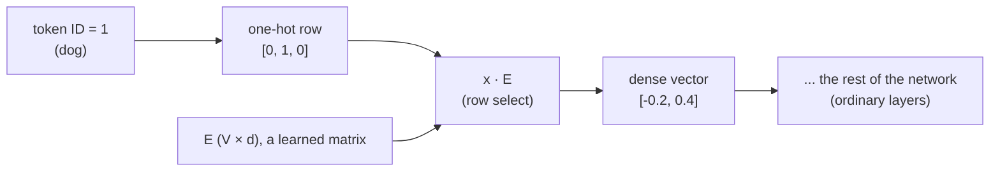

# Embeddings: From One-Hot Vectors to Learned Representations

Everything in the previous notes assumed the network's input was already a list of numbers — `x1 = 1, x2 = 2`, pixel intensities, whatever. But most interesting data is not numeric. "cat", "dog", "bank", user IDs, product IDs, words of a sentence. Neural networks cannot multiply the string `"cat"` by a weight matrix. Somewhere between the raw symbol and the first linear layer, a translation to numbers must happen, and the way we do it — the **embedding layer** — turns out to be one of the most consequential ideas in modern deep learning.

This note builds embeddings out of parts you already own: one-hot vectors (from the softmax note), a plain weight matrix, and the backward loop we already derived. There is no new machinery here. There is a new *perspective*: the first layer of the network is better understood as a lookup table whose rows are learned like any other weight.

Assumed background: [the NumPy backprop note](/posts/ml/2026-09-14-1-training-a-2-layer-network-in-numpy) for matrix shapes and the layer loop, and the [softmax note](/posts/ml/2026-09-14-3-softmax-and-multiclass-cross-entropy) for one-hot vectors.

---

## 1. Encoding symbols as numbers, attempt 1: IDs

The simplest idea: give every symbol an integer.

$$
\text{cat} \to 0,\qquad \text{dog} \to 1,\qquad \text{bank} \to 2
$$

and feed the ID into the network as a feature. Two fatal problems:

1. **Fake ordering.** The network will compute things like $w \cdot \text{id}$. It learns correlations like "ID 2 leads to smaller logits than ID 0," as if `bank` were "more" than `dog`, numerically. We've injected an ordering/geometry that does not exist in the data, and the model has to learn around our fake constraint.
2. **It doesn't scale in expressiveness.** One scalar can't carry every useful property of a word/product/user.

The IDs are fine *as bookkeeping*. They are terrible *as features*.

## 2. Attempt 2: one-hot vectors

Give every symbol a coordinate axis instead of a number. With a vocabulary of 3 symbols:

$$
\text{cat} = \begin{bmatrix} 1 \\ 0 \\ 0 \end{bmatrix} \qquad
\text{dog} = \begin{bmatrix} 0 \\ 1 \\ 0 \end{bmatrix} \qquad
\text{bank} = \begin{bmatrix} 0 \\ 0 \\ 1 \end{bmatrix}
$$

Properties, good and bad:

- No fake ordering: every pair of distinct symbols is at the same distance $\sqrt{2}$, and every symbol is orthogonal to every other. Geometrically the vocabulary is a set of independent axes; the data may now choose its own geometry.
- **It is huge.** Real vocabularies: $V = 50{,}000$ tokens (GPT-2), or millions of product IDs. Every input vector is a 50,000-entry vector with 49,999 zeros.
- **It carries zero information about similarity.** "cat" and "dog" are exactly as different as "cat" and "satellite." If the model learns something about "dog," the one-hot encoding gives it no way to transfer any of that knowledge to "cat."
- It wastes the representational space: in 50,000 dimensions the vocabulary occupies 50,000 isolated corner points, and the rest of the space is unused.

> , they're points like (1,0) 1 on x axis, another is 1 on y-axis and 1 on z-axis, ... so distance b/w each toehr is same for any 2 pairs.

So one-hot is the right *interface* (clean, faithful, geometry-free), but it is 50,000 entries of bookkeeping that carries no meaning. The fix: immediately compress it into something dense, and let the *training loss* decide what geometric relationships make sense.

## 3. The embedding layer = one-hot × a matrix

Take the one-hot vector and multiply it by a weight matrix. Concretely, suppose we want 2-dimensional word vectors for our 3-symbol vocabulary. Define a matrix $E$ of shape $(V, d) = (3, 2)$:

$$
E = \begin{bmatrix}
0.3 & 0.1 \\
-0.2 & 0.4 \\
0.5 & 0.5
\end{bmatrix}
\begin{matrix}& \leftarrow \text{row 0: cat} \\ & \leftarrow \text{row 1: dog} \\ & \leftarrow \text{row 2: bank}\end{matrix}
$$

and compute, with the one-hot as a row vector (the batch convention from the NumPy note):

$$
\text{vec}(\text{dog}) = x_{\text{dog}} \, E = \begin{bmatrix} 0 & 1 & 0 \end{bmatrix}
\begin{bmatrix}
0.3 & 0.1 \\
-0.2 & 0.4 \\
0.5 & 0.5
\end{bmatrix} = \begin{bmatrix} -0.2 & 0.4 \end{bmatrix}
$$

Work the multiplication by hand and notice what happened. The one-hot zeros wiped out rows 0 and 2, and the single 1 in position 1 selected row 1. **The matrix product did row selection.** That's the entire mechanism:

$$
\text{embedding}(\text{symbol } i) = \text{row } i \text{ of } E
$$

The embedding *is* the $i$-th row of a learned matrix. No implementation actually multiplies anything: the code does `E[1]`. It is indexing/collection, marketed as linear algebra. Two consequences worth internalizing:

1. **The embedding layer is exactly a linear layer** with a one-hot input. There's no new math. It is `forward` from our layer loop with $A[0] = \text{one-hot}$ and $W[1] = E$. Everything else in the network above it is a completely ordinary stack of layers that sees dense vectors.
2. **The one-hot never even has to exist.** Because multiplying a matrix by a one-hot is just indexing the matrix, real implementations take the integer token ID directly. `nn.Embedding(V, d)` in PyTorch is precisely a wrapper around a `(V, d)` parameter matrix plus indexing. The one-hot framing is for understanding; the ID framing is what actually happens.

The dimension $d$ is a design choice, typically much smaller than $V$: 300 (word2vec era), 768 (BERT base), 4096, etc. The lexicon now lives in a $V \times d$ parameter blob, and each symbol gets a dense point in a $d$-dimensional space rather than an isolated axis in $V$ dimensions.



> There is lot to unpack here, let's go one step at a time 
>
> ### Problem with representation of words
> 
> The problem is representation of words: We start with a naive approach. Let's assume the english vocabulary contains 50,000 words, we could represent each of them with a column matrix where only entry is 1 and all tohers are 0's. We can imagine it as large identity matrix of size 50k. Let's call this matrix **V** and **d** is the index of each word in to this matrix.  
>
> Now the problem with this is: our representation does not contain any semantic information at all. Every word is equi-distant with each other. But a more useful representation is if we could extract semantic features out of a word and use it for representation, that way the word **cat** would be closer to the word **dog** rather than the word **satellite**. 
>
> Now that we understand the limitation with the naive approach, let's take it one step forward. Let's introduce a new matrix **E** called embedding matrix. Its intention is to extract some semantic features out of words and assign parameters to it.
>
> Let's say we want to express a word in terms of two parameters: **cat** could probably be **[0.03, -0.71]**, **dog** could probably be  **[0.45, 0.12]**. The above paragraph made it pretty clear how multiplication of a one hot vector with **E** is useless as all it does is index into **E**, so i am not going there. Whole point of it was "That giant diagonal matrix doesn't even need to exist, we need some integer id's for each word - that's pure bookkeeping." So we can assume **E** as a matrix of **(50,000, 2)** where each word gets its own row. 
>
> **How to make sense of Embedding matrix E?**
>
> We assigned two parameters for **E** earlier, but we might ask are two params sufficient to express sufficient semantic features of a word? May not be, but it was just an example, but the main idea was the number of params certainly doesn't need to be **50,000**, it's certainly lot lesser than that. 
> Word2Vec picked 300 params
>
> ```
> One-hot space (V=50,000 dims)     Embedding space (d=300 dims)
> cat   [1,0,0,...,0]          →    [0.2, -0.5, 0.8, ...]
> dog   [0,1,0,...,0]    E     →    [0.3, -0.4, 0.7, ...]
> bank  [0,0,1,...,0]          →    [-0.9, 0.1, 0.2, ...]
> ```
> Cat and dog end up near each other in 300-d space. Cat and bank end up far apart. That distance now means something, unlike one-hot where every distance was identical.
>
> **Why $d \ll V$**
> The note says $d$ is "much smaller than $V$." Concretely: $V = 50{,}000$, $d = 300$.
> 
> The intuition is: you don't need 50,000 dimensions to describe the meaningful variation between words. The things that actually matter — is this word an animal? a verb? does it appear in formal contexts? is it emotionally positive? — maybe a few hundred dimensions are enough to capture all those axes of variation. 300 numbers can carry a lot of information about a word's meaning and usage.
> 
> If you kept $d = V = 50{,}000$, you'd have a square matrix that learns nothing useful — it would just be memorizing. The compression to $d \ll V$ forces the network to find a *dense, efficient* representation where similar words share structure.
>
> ### How is the Embedding Matrix Trained?
>
> 
> $E$ is trained the same way as every other weight matrix in the network. You run forward pass → compute loss → backprop → update. The gradient flows back through the network, reaches the embedding layer, and says "row 1 (dog), move in this direction." After thousands of examples, row 1 has been nudged thousands of times by signals that came from actual usage of "dog" in real sentences.
>
> The reason "cat" and "dog" end up with similar vectors is that the *loss function* kept punishing the network similarly for both words. If your task is next-word prediction:
>
> - "The ___ sat on the mat" → cat, dog both work
> - "Feed the ___" → cat, dog both work  
> - "The ___ chased the ball" → cat, dog both work
>
> Both rows receive similar gradient signals thousands of times. They drift toward each other. Nobody programmed this. It fell out of gradient descent.
>
> **So the full picture is:**
> ```
> Start: E is random noise
>        ↓
> Forward pass: look up row i (meaningless vector)
>        ↓
> Loss: network was wrong
>        ↓
> Backprop: "row i, here's how to be less wrong"
>        ↓
> Update: row i shifts slightly
>        ↓
> Repeat 1,000,000 times
>        ↓
> End: rows that appeared in similar contexts 
>      have drifted toward similar regions
> ```
> And importantly, $d\ll V$ doesn’t mean we’re reducing the total number of learned parameters compared with the one-hot representation — the one-hot vectors themselves aren’t learned parameters at all.
>
> The embedding isn’t explicitly extracting predefined features like:
> ```
> [is_animal, is_alive, is_positive, ...]
> ```
> Instead, it learns a vector that is **useful for the training objective**. Semantic structure can emerge because semantics affects how words are used, but the coordinates don’t have predefined meanings. The embedding learns a compact vector representation whose geometry becomes useful for the task.
>
> Let's take a step back further, we tried to understand the training of embedding without understanding how the neural network which trains it looks like
>
> ### How does the Neural Network training the Embedding Matrix Looks Like? 
>
> I had imagined two things
> 1. Training embedding is just a part of some bigger neural networks which does lot of other things. 
> 2. A standalone neural network just for training the embedding. 
>
> The reason for guessing the **1** option was i heard that i read modern LLM's don't rely on a static pretrained embedding weights instead dynamically trains it continuously.
>
> Turns out both options exist but **option 1** is the more common case today. 
>
> #### Case 1: Embedding trained as part of a bigger network
>
> This is the most common case. The embedding layer is just the first layer of a larger network. $E$ gets trained alongside everything else via the same backprop loop. No special treatment.
> 
> For example in a sentiment classifier:
>
> ```
> word ID → embedding lookup → hidden layers → softmax → "positive/negative"
> ```
> $E$ trains because gradients flow back through the whole network and reach it. The task defines what "useful embedding" means. You don't think about $E$ separately — it just gets learned.
>
> Same thing happens in transformers (GPT, BERT). The embedding layer is literally the first layer, $E$ trains with everything else, and nobody calls it a separate model.
>
> #### Case 2: Specialized networks built specifically to train good embeddings
>
> Sometimes people decided: what if we built a tiny, fast, purpose-built network whose *only job* is to produce good embeddings? Then we take those embeddings and use them elsewhere.
>
> This is where named models come in.
> 
> **Word2Vec** (Google, 2013) is the famous one. It's a shallow two-layer network trained on a simple task:
> ```
> "cat sat on the mat"
>          ↓
> Task: given center word "sat", predict surrounding words
>       OR given surrounding words, predict center word
> ```
> The network is intentionally kept tiny and simple. You train it, then throw away the network and keep only $E$. Those rows are your word vectors. 300-dimensional, trained on billions of sentences, packaged up and shipped as a file others can download and use directly.
>
> **GloVe** does something similar but uses co-occurrence counts directly instead of a neural network.
>
> These are called **static embeddings** — every word has one fixed vector regardless of context. "Bank" has the same vector whether you're talking about a river bank or a financial institution.
>
> **The problem static embeddings couldn't solve**
> 
> One vector per word means you can't handle words with multiple meanings. This is where the next generation came in.
>
> **BERT, GPT** don't produce a fixed lookup table. Instead the entire deep network runs on your input sentence and produces *contextual* embeddings — the vector for "bank" changes depending on the surrounding sentence. But now you can't just extract $E$ and ship it, because the meaning lives in the whole network's computation, not just the first layer.
>
> **So the direct answer to your question:**
>
> ```
> Is embedding training its own specialized NN?
>        │
>        ├── YES: Word2Vec, GloVe
>        │   Purpose-built, shallow, fast
>        │   You keep E, discard the network
>        │   One vector per word forever
>        │
>        └── NO: Everything modern (BERT, GPT, your sentiment classifier)
>            E is just layer 1 of a bigger network
>            Trains alongside everything else
>            Contextual meaning lives in the full network
> ```
>
> Word2Vec was historically important because in 2013 training BERT-scale models wasn't feasible. So people pre-trained embeddings cheaply, then plugged them into other networks as a starting point instead of random initialization. That trick — **pre-trained embeddings as initialization** — was the ancestor of the modern idea of pre-training entire large models and fine-tuning them, which is what GPT and BERT do.
>
> ### How does the Feedback Loop that trains the network looks like?
>
> The training of neural network happens by asking it **fill in blank type of questions** 
>
> It will produce a **softmax** style output vector of dimension (50,000, 1), each entry indicating the probability of that word. 
>
> ```
> “The ___ sat on the mat” → cat, dog both work
> “Feed the ___” → cat, dog both work
> "He deposited money in the ___" → bank
> ```
>
> We generate millions of such questions and ask it to answer them. But now we face a real problem: The answer can't be a static one word answer. For eg: given a sentence like "The ___ sat on the mat", let's say we hardcode our expected output as a one hot vector with answer as **dog**, but the network predicts it as **cat**, then instead of giving it maximum penalty, we should give it only a very small penalty. But if it predicts something like **rat**, penalty should increase slightly, if it predicts something like **fish**, it should be very high, and if it predicts something like **car** the penalty should be highest. 
>
> So the point is the loss function not just depends on the output, but the distribution of words. Meaning output words that are closely spread across the expected words get minimal penalty and words which are distributed away from output word get high penalty. This means our output label should carry this information instead of just a one hot encoding of the answer word. This is going to be a tedious task to prepare such a dataset, imagine preparing 100 such fill in the blanks where we mark each 50,000 output words with the penalty they get by hand, now imagine doing it for a million such cases. We can clearly see this is not a scalable approach. 
>
> **If only we could automate the generation of output vector with the information about distribution. Because imagine if we had a magical system that generates this output vector, then the enxt question is why can't we just use that magical system directly instead of using it to train a neural network?**
> 
> This thought process is real and so are its limitations - in order to create the thing, we need the thing. But there was some research around creating a powerful teacher model and using it to generate output labels for other models. If the teacher is good enough, why not just use the teacher directly? The answer is cost: the teacher might be too large to run in production, so you distill its knowledge into a smaller faster model. This is how models like DistilBERT were made.
>
> More importantly we found that using a simple one hot encoded labels for training data works magic in ways we didn't think it was possible before, we will see this next. 
>
> **Why one hot encoding for output labels works best here?**
>
> First of all, using one hot encoding removes the entire problem of having a probabilistic output vector which we saw above. **This means we can easily run millions of fill in the blanks type of training as output can be easily labelled.**
>
> The loss is just plain one-hot cross-entropy every single time:
> 
> $L=−logp_{actual next word}​$
> 
> Simple and scalable. No human labeling needed. No soft penalty vectors needed.
>
> **Then we are back to the original problem - if we use one hot encoding we are giving hard penalty to the network even if it predicts nearest word - for eg: cat instead of dog. And the penalty is same if it predicts car instead of dog.**
>
> The above statement is absolutely true, but there is something more happening. When we give hard penalty to a model for predicting cat instead of dog, what happens internally is we are nudging the embedding weights of the word dog in a particular direction and if our training data is large enough, of course there will be another sentence which asks  “The ___ sat on the mat” and expects **cat** as the answer, so the embedding weights of **cat** gets nudged in the similar direction. But since we are using realistic sentence in training, there won't be a sentence expecting **rat** or **car** which means those embeddings of those words won't be nudged in similar direction. 
>
> So geometrically, we can imagine the vectors of **cat** and **dog** in n-dimentional space to be somewhat closer because most of their sentences will be common, but there will also be sentences which are specific to **cat** and some others specific to **dog** which contributes to the difference between them. 
>
> The exact same sentence appearing twice is a bit lucky. The stronger point is that structurally similar sentences push cat and dog together — not just the identical template. Worth saying: "there will be thousands of different sentences with similar structure where cat works just as well as dog."
> 
> The model has learnt something more than we intended, it didn't just learn to answer the fill in the blanks questions, but it also learnt about semantic relationship between the words which is what separates this model from previous attempts. 
>
> Let's look at little bit of history of previous attempts to understand why this is superior
>
> Before neural networks dominated NLP, people actually used HMMs and n-gram models to do language tasks. The progression historically was:
>
> ```
> n-gram models (count based)
>        ↓
> HMMs (probabilistic state machines)
>        ↓
> Neural networks with embeddings (Word2Vec era)
>        ↓
> Deep LSTMs
>        ↓
> Transformers (GPT, BERT)
> ```


## 4. How the rows get learned: following the gradient back

> This section lacks pre-requisites. Let's put them in place one-by-one
>
> **Problem 1: How is the input sentence represented?**
>
> It's always predicting the next word, never a middle blank. The blank-in-middle framing was just intuition building. Real training looks like:
>
> "The cat sat on the mat"
>
> Gets sliced into examples:
>
> ```
> Input: ["The"]                    → Target: "cat"
> Input: ["The", "cat"]             → Target: "sat"
> Input: ["The", "cat", "sat"]      → Target: "on"
> ```
> Each input is a *sequence* of token IDs. Each token ID gets looked up in $E$ separately. So for input ["The", "cat", "sat"], you do three lookups:
>
> ```
> E[3]  → vector for "The"
> E[0]  → vector for "cat"  
> E[4]  → vector for "sat"
> ```
> Now you have three vectors which get passed into the rest of the network. How those three vectors get *combined* is a separate problem — that's where LSTMs and Transformers come in. For now just accept: each word in the input gets its own embedding lookup independently.
>
> On the X matrix:
> ```
> X = [
>  [one-hot("The")],                        → y = one-hot("cat")
>  [one-hot("The"), one-hot("cat")],         → y = one-hot("sat")  
>  [one-hot("The"), one-hot("cat"), one-hot("sat")]  → y = one-hot("on")
> ]
> ```
> But notice X is now jagged — rows have different lengths. That's messy. In practice you fix a maximum context length and pad shorter sequences:
>
> ```
> X = [
>  [one-hot("The"),  PAD,              PAD          ] → y = one-hot("cat")
>  [one-hot("The"),  one-hot("cat"),   PAD          ] → y = one-hot("sat")
>  [one-hot("The"),  one-hot("cat"),   one-hot("sat")] → y = one-hot("on")
> ]
> ```
>
> Each row is now fixed length. Each cell gets its own embedding lookup. You end up with a 3D block: (examples × context_length × d).
>
> Transformers and LSTM seems to be doing heavy lifting when it comes to input encoding, so i am deferring questions from this sections to later. My questions were mainly around input ordering 0 how does network perceive the ordering of words.


Now the key question — $E$ starts *random*; how does row $i$ come to mean anything? The answer is the backward pass from the NumPy note, specialized to the fact that the input was a one-hot.

Slot the embedding layer into the general loop as layer 1: $A[0] = x$ (one-hot), $W[1] = E$. The backward pass computes, as always:

> $A[0] = X$ is just python code specifics where we reuse matrices we treat input as first layer of activations. 
> 
> $W[l]$ = weights of layer $l$, just mentioning that embeddings is same as first layer's weights. 

$$
dE = X^T \, \delta^{[1]}
$$

> Nothing new so far, its the same formula we saw for $dW$ earlier.

where $\delta^{[1]}$ is the error message arriving at the embedding layer's output from downstream (shape: examples × $d$). Now look at what $X^T$ does. In the batch design matrix $X$ (examples × $V$), row $r$ of $X$ is the one-hot of example $r$'s symbol. When the product $X^T \delta^{[1]}$ is computed, row $i$ of the result sums the messages of *exactly those examples whose symbol was $i$*:


$$
\frac{\partial L}{\partial E_{i,:}} = \sum_{r \,:\, \text{symbol of example } r = i} \delta^{[1]}_{r,:}
$$

and all other rows of $dE$ are **exactly zero**. Do it on a small batch to see it plainly. Two examples, batch $X$:

$$
X = \begin{bmatrix}
0 & 1 & 0 \\
0 & 0 & 1
\end{bmatrix}
\begin{matrix}& \leftarrow \text{example 1 was dog} \\ & \leftarrow \text{example 2 was bank}\end{matrix}
\qquad
\delta^{[1]} = \begin{bmatrix}
0.4 & -0.1 \\
0.1 & 0.2
\end{bmatrix}
$$

Then:

$$
dE = X^T \delta^{[1]} = \begin{bmatrix}
0 & 0 \\
1 & 0 \\
0 & 1
\end{bmatrix}
\begin{bmatrix}
0.4 & -0.1 \\
0.1 & 0.2
\end{bmatrix} = \begin{bmatrix}
0 & 0 \\
0.4 & -0.1 \\
0.1 & 0.2
\end{bmatrix}
$$

> Note: this is a very simplified example, each input is 1 input word and 1 output word. We are not inputting sentences and asking for next word as it introduces some complexity which is answered in transformers/LSTM chapters. 

Only rows 1 and 2 of the embedding matrix receive gradient, because only tokens 1 ("dog") and 2 ("bank") appeared in the batch. Row 0 ("cat") receives exactly nothing this step. The update rule `E -= lr * dE` therefore nudges *only the rows that were looked up*, by amounts driven by the errors those lookups caused downstream.

(One engineering consequence: with $V = 50{,}000$, the gradient matrix is 99.99% zeros, so real implementations skip computing the full $dE$ and just do sparse/rowwise updates on the looked-up rows. The math above is what the fast code is emulating.)

And within a row: the gradient that arrives is a *direction in $d$-space*, determined by how the rest of the network used the vector. If "dog" embeddings usually helped when their first coordinate was big, repeated updates grow that coordinate. Over many batches, each token's row is drifted toward a vector that is *useful for the task the network is training on*.

## 5. Why similar things end up with similar vectors

This is the part that sounds mystical and isn't. Take the classic example — word embeddings trained on next-word-ish objectives — and walk the chain of causation:

1. "cat" and "dog" appear in statistically similar contexts ("the ___ sat", "feed the ___", "my ___ is loud").
2. The objective is to predict what comes next (or what fits around), so similar contexts produce similar target distributions for them.
3. Similar targets send similar downstream demands, which produce similar $\delta$ messages to whichever row got looked up.
4. Thousands of updates later, row "cat" and row "dog" have been pushed by similar gradients from similar random starting points, and they end up near each other in $d$-space.

Nothing was told "cats and dogs are similar." The network discovered it because *being confused with each other was the cheapest way to reduce the loss*. The closeness is functional, learned geometry: two words are "close" if the network's job profits from treating them alike. The same argument inverts for dissimilarity: if confusing "cat" and "bank" is expensive, the gradient systematically separates the two rows (note that "bank" — the financial institution and the river's edge — has only one row despite obviously living in two meaning clusters; that failure gets fixed by contextual models later).

The famous arithmetic — `king − man + woman ≈ queen` — is the same story with one more level of structure. If the relation "gender of monarch" shows up as approximately a consistent direction in the space across many pairs, then offsets encode relations and vector addition recovers them. It does happen; it works because the training objective puts pressure on that geometry; and it is *not* guaranteed or mystical. When a paper shows such analogies working, it's reporting that the pressure succeeded, approximately, on average, in those regions of the space.

The skepticism worth keeping: **coordinates have no names.** Nothing in dimension 7 of an embedding "is" about size, or animacy, or anything. Dimensions are reusable abstract scaffold whose interpretation is distributed. Reading off "what the model knows" from a naive per-dimension analysis of embeddings is reading tea leaves. The geometry (relative closeness, subspace structure) is real; axis-by-axis semantics are not.

> Let's see if we can make sense of this mathematically. Before doing it mathematically, let's try to do it logically: 
> Let's say $E(cat)$ and $E(dog)$ are randomly assigned values (we don't care yet if they are nearly equal or not). Let's say both cat and dog appear in a million sentences, with 95% of sentences having common semantics. Each sentence can be treated as an equation. So the goal of training process is find solution to these 1 million equations where 95% of equations are similar between both. Since the gradient descent tries to minimze the loss function, chossing the exact same embeddings for both cat and dog will already get 95% of equations right, it has to try to nudge only if good amount of those remaining 5% equations can be solved without losing the correctness of 95%, it might find a way to say, get +3% of those equations right by sacirificing -1% of that 95%, in this case the vectors for cat and dog will slightly differ. (This is only for visualization - don't take this literally).
> 
> 
> **Setup: two training examples**
>
> Example 1: "The cat sat on the mat" → input context produces some vector, target = "mat"
>
> Example 2: "The dog sat on the mat" → input context produces some vector, target = "mat"
>
> Same structure, same target. Only difference: "cat" vs "dog" in position 2.
> 
> This reveals another important example: it's not always about cat or dog - here its about predicting mat even if input changes from cat to dog. This is only possible if the only variable factor in the equation $E(cat) \approx E(dog)$. Now that i think about it, i feel like such cases will hammer $E(cat)$ and $E(dog)$ harder to be similar than the cases which involves the predicting the words cat and dog themselves. Because the input is screaming that both have to be close, there's no other way. Compared to the inputs where we predict cat or dog, where NN still has some guess work left.
>
> This is interesting than i thought and i feel this here is stronger proof than mathematical representation. 
>
> **What you're identifying is the difference between two types of gradient pressure:**
>
> **Type 1: Predicting cat/dog as output**
>
> ```
> "I love my ___" → cat
> "I love my ___" → dog
> ```
>
> Here cat and dog are *targets*. The gradient $\delta^{out} = p - y$ hits different one-hot positions — one points at cat's row in the softmax weight matrix, the other at dog's row. These are separate signals that don't directly talk to each other. The embedding rows for cat and dog aren't being compared here.
>
> **Type 2: cat/dog as input, same target**
> 
> ```
> "The ___ sat on the mat" → mat (cat as input)
> "The ___ sat on the mat" → mat (dog as input)
> ```
>
> Here cat and dog are *inputs*. The network has to produce the same output "mat" regardless of whether it received $E[\text{cat}]$ or $E[\text{dog}]$. The only way to consistently do this is if $E[\text{cat}]$ and $E[\text{dog}]$ produce similar enough activations in the hidden layer that the same weights route both toward "mat."
>
> So yes — Type 2 is a much harder, more direct constraint on the embedding rows. It's not just "these two words get similar gradients this step." It's "the network literally cannot solve this task unless these two vectors behave similarly."
> 
> **Your phrase "the input is screaming" is the right intuition**
>
> In Type 1, the pressure on embeddings is indirect — the gradient has to travel from the output, back through hidden layers, back to the embedding row. Many things can absorb that signal along the way.
>
> In Type 2, the constraint is structural. If $E[\text{cat}]$ and $E[\text{dog}]$ are very different, the hidden layer receives very different inputs for two examples that should produce the same output. The network has to work much harder to reconcile this — it has to learn separate pathways for cat and dog that both happen to lead to "mat." That's expensive in terms of parameters and loss. The cheap solution is just make $E[\text{cat}] \approx E[\text{dog}]$.
>
> **There's a name for this principle**
>
> What you've described is essentially why **distributional similarity** works. The linguist J.R. Firth said in 1957:
>
> > "You shall know a word by the company it keeps."
>
> Meaning: words that appear in the same contexts (Type 2 pressure) are more definitionally similar than words that appear as similar predictions (Type 1 pressure). Your mathematical intuition arrived at the same conclusion independently — Type 2 hammers the embeddings harder toward similarity because the task structurally requires it.
>
> Word2Vec was actually designed specifically to maximize Type 2 pressure — it takes a center word and predicts surrounding words, or takes surrounding words and predicts the center. Every training example is explicitly of the form "different inputs, same context" which is exactly the pressure you identified as stronger.
>
> TL;DR: all things for the equations are same, including the inputs and values that flow backwards, the only the only variables left are $E(cat)$ and $E(dog)$, for those equation of millions of similar sentences to hold true the embeddings will eventually have to become similar. 
> 
> **Forward pass for both**
>
> After embedding lookup and passing through the network, both examples reach the softmax layer and produce probability distributions. Call them $p^{(cat)}$ and $p^{(dog)}$ over all 50,000 words.
>
> Now here's the key question: how similar are $p^{(cat)}$ and $p^{(dog)}$?
>
> Early in training, $E[\text{cat}]$ and $E[\text{dog}]$ are both random and roughly similar in magnitude. The hidden layers apply the same weight matrices $W[2], W[3]$ to both. So the network produces roughly similar outputs:
> 
> $$p^{(\text{cat})} \approx p^{(\text{dog})}$$
>
> Not identical, but close. Both are confused, random distributions early on.
>
> **The gradient at the softmax layer**
>
> You already know this from the softmax note:
>
> $$\delta^{out} = p - y$$
>
> For both examples, $y$ is identical — one-hot at "mat". So:
>
> $$\delta^{out}_{\text{cat example}} = p^{(\text{cat})} - y$$
> $$\delta^{out}_{\text{dog example}} = p^{(\text{dog})} - y$$
>
> Since $p^{(\text{cat})} \approx p^{(\text{dog})}$, we get:
>
> $$\delta^{out}_{\text{cat example}} \approx \delta^{out}_{\text{dog example}}$$
>
> **Backprop through hidden layers**
>
> The gradient flows backward through each hidden layer. At each layer $l$, the backprop formula is:
>
> $$\delta^{[l]} = (\delta^{[l+1]} \cdot W^{[l+1]T}) \odot \sigma'(z^{[l]})$$
>
> The same weight matrices $W$ appear for both examples. So if the incoming $\delta$ is similar, the outgoing $\delta$ is also similar. This holds at every layer all the way back down to the embedding layer:
>
> $$\delta^{[1]}_{\text{cat example}} \approx \delta^{[1]}_{\text{dog example}}$$
>
> **The gradient update to $E$**
>
> Now plug into $dE = X^T \delta^{[1]}$. For the cat example:
>
> $$dE[\text{cat row}] = \delta^{[1]}_{\text{cat example}}$$
>
> For the dog example:
>
> $$dE[\text{dog row}] = \delta^{[1]}_{\text{dog example}}$$
>
> Since $\delta^{[1]}_{\text{cat}} \approx \delta^{[1]}_{\text{dog}}$, both rows receive approximately the same update vector.
>
>**The full chain written out:**
>
> $$\underbrace{y_{\text{cat}} = y_{\text{dog}}}_{\text{same target}} \implies \underbrace{\delta^{out}_{\text{cat}} \approx \delta^{out}_{\text{dog}}}_{\text{similar output gradient}} \implies \underbrace{\delta^{[1]}_{\text{cat}} \approx \delta^{[1]}_{\text{dog}}}_{\text{same W matrices applied}} \implies \underbrace{dE[\text{cat}] \approx dE[\text{dog}]}_{\text{similar row updates}}$$
>
> **Why they don't become identical**
>
> Two forces pull them apart:
>
> First, $p^{(\text{cat})}$ and $p^{(\text{dog})}$ are not exactly equal even early on, and as training progresses they may diverge slightly as the rows diverge.
>
> Second, cat and dog appear in sentences unique to each:
>
> ```
> "The cat purrs"  → only cat row gets this gradient
> "The dog barks"  → only dog row gets this gradient
> ```
>
>These unique contexts send different gradient signals, pushing the rows apart in dimensions that capture the cat-vs-dog distinction.
>
> **The final picture**
>
>After thousands of batches, each row is the sum of all gradient pressure it ever received:
>
> ```
> E[cat] = random_init + Σ(gradients from shared sentences) + Σ(gradients from cat-only sentences)
> E[dog] = random_init + Σ(gradients from shared sentences) + Σ(gradients from dog-only sentences)
> ```
>
> The shared sentence gradients are approximately equal and push both rows in the same direction. The unique sentence gradients differ and create the separation between them. The geometry that emerges — cat and dog nearby, cat and bank far apart — is entirely determined by which gradient pressures dominated across training.

## 6. Embeddings as the network's first representation

Revisit the picture of a layer stack: every layer after the first consumes the *output* of the previous layer, not the raw input. With words, the embedding layer is simply the first link in that chain: it converts symbol → dense vector, and every later layer sees "dreams of symbols" — internal vectors — never the tokens themselves. One-hot is the last place the raw token exists as such.

This is also why `nn.Embedding` appears in effectively every language/recommendation/transformer architecture as literally the first layer. The entire sophistication of the model begins from the geometry this table sets up:

$$
\text{token ID} \;\longrightarrow\; \text{row lookup} \;\longrightarrow\; \text{dense } d \text{-vector} \;\longrightarrow\; \text{everything else}
$$

## 7. Summary

- Symbol IDs are bookkeeping, not features: integer IDs inject false ordering; one-hot fixes that at the cost of dimension $V$, 99.998% zeros, and zero similarity information.
- An embedding layer is a $(V, d)$ matrix $E$ whose $i$-th row is the vector for symbol $i$. One-hot × matrix = row selection, so in code it's just indexing; mathematically, it is the plain linear layer we already know.
- Backprop through it is the ordinary $X^T \delta$: rows get exactly the summed messages of the examples that used them, and untouched rows get exactly zero. Implementations exploit this sparsity.
- Embeddings acquire structure because similar environments produce similar gradient pressure on a row. Closeness = "cheap to confuse under this objective." It's functional geometry, not magical semantics; and axes have no names.
- Everything downstream consumes the learned dense vectors, never the raw symbols.
> - Input encoding with multiple words, word ordering, and how context gets combined — all deferred to Transformers/LSTM, which handle the 3D block (examples × context_length × d) that the embedding layer produces

## 8. Exercises

1. With the 3-word vocabulary of section 3, suppose a batch has 4 examples whose tokens are, in order, dog, dog, cat, bank, and the arriving messages are the rows of
$$\delta^{[1]} = \begin{bmatrix} 1 & 0 \\ 2 & 0 \\ 0 & 1 \\ 1 & 1 \end{bmatrix}.$$ Compute $dE$ (shape $3 \times 2$) without multiplying matrices — use the row-sum argument. Which row of $E$ moves the most in the Euclidean sense?
2. Why, after training, can dot products of embedding rows be used to rank similarity — and what specifically about the training process makes that ranking meaningful rather than random?
3. Word2Vec's CBOW predicts a word from its context. Sketch — in words — the gradient argument that explains why "cat" and "dog" converge in CBOW. Where in your sketch does the objective define "similarity"?
4. Suppose you have 1M user IDs and $d = 64$. Compare `nn.Embedding(1M, 64)` against `nn.Linear(1M, 64)` fed one-hot inputs. Show that the two have the *same* parameter count and produce the *same* output. What, then, is the actual runtime reason practitioners always choose the embedding lookup? (Hint: think about what happens to the 999,999 zeros during the matrix multiply, and what memory must be touched to do it.)
5. "Coordinates have no names": argue from the training process that any rotation $R$ applied to every embedding row together with the inverse rotation applied to the next layer's weight matrix leaves the network's function unchanged. What does this say about claims like "dimension 12 encodes animacy"?

## 9. What comes next

Embeddings give every token a static vector. "bank" in "river bank" and "investment bank" are the same row of $E$ — and language meaning is not static. The [next note](/posts/ml/2026-09-20-1-attention-turning-token-vectors-into-context) introduces attention: the mechanism that mixes token vectors with their sentence-mates so that the representation of "bank" depends on who its neighbors are. Softmax (from the previous note) turns out to be the mixing knob.
