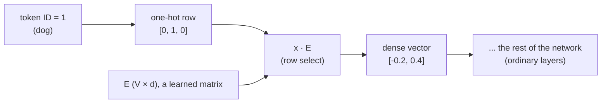

# Embeddings: From One-Hot Vectors to Learned Representations

Everything in the previous notes assumed the network's input was already a list of numbers — `x1 = 1, x2 = 2`, pixel intensities, whatever. But most interesting data is not numeric. "cat", "dog", "bank", user IDs, product IDs, words of a sentence. Neural networks cannot multiply the string `"cat"` by a weight matrix. Somewhere between the raw symbol and the first linear layer, a translation to numbers must happen, and the way we do it — the **embedding layer** — turns out to be one of the most consequential ideas in modern deep learning.

This note builds embeddings out of parts you already own: one-hot vectors (from the softmax note), a plain weight matrix, and the backward loop we already derived. There is no new machinery here. There is a new *perspective*: the first layer of the network is better understood as a lookup table whose rows are learned like any other weight.

Assumed background: [the NumPy backprop note](/posts/ml/2026-09-14-1-training-a-2-layer-network-in-numpy) for matrix shapes and the layer loop, and the [softmax note](/posts/ml/2026-09-14-3-softmax-and-multiclass-cross-entropy) for one-hot vectors.

---

## 1. Encoding symbols as numbers, attempt 1: IDs

The simplest idea: give every symbol an integer.

$$
\text{cat} \to 0,\qquad \text{dog} \to 1,\qquad \text{bank} \to 2
$$

and feed the ID into the network as a feature. Two fatal problems:

1. **Fake ordering.** The network will compute things like $w \cdot \text{id}$. It learns correlations like "ID 2 leads to smaller logits than ID 0," as if `bank` were "more" than `dog`, numerically. We've injected an ordering/geometry that does not exist in the data, and the model has to learn around our fake constraint.
2. **It doesn't scale in expressiveness.** One scalar can't carry every useful property of a word/product/user.

The IDs are fine *as bookkeeping*. They are terrible *as features*.

## 2. Attempt 2: one-hot vectors

Give every symbol a coordinate axis instead of a number. With a vocabulary of 3 symbols:

$$
\text{cat} = \begin{bmatrix} 1 \\ 0 \\ 0 \end{bmatrix} \qquad
\text{dog} = \begin{bmatrix} 0 \\ 1 \\ 0 \end{bmatrix} \qquad
\text{bank} = \begin{bmatrix} 0 \\ 0 \\ 1 \end{bmatrix}
$$

Properties, good and bad:

- No fake ordering: every pair of distinct symbols is at the same distance $\sqrt{2}$, and every symbol is orthogonal to every other. Geometrically the vocabulary is a set of independent axes; the data may now choose its own geometry.
- **It is huge.** Real vocabularies: $V = 50{,}000$ tokens (GPT-2), or millions of product IDs. Every input vector is a 50,000-entry vector with 49,999 zeros.
- **It carries zero information about similarity.** "cat" and "dog" are exactly as different as "cat" and "satellite." If the model learns something about "dog," the one-hot encoding gives it no way to transfer any of that knowledge to "cat."
- It wastes the representational space: in 50,000 dimensions the vocabulary occupies 50,000 isolated corner points, and the rest of the space is unused.

So one-hot is the right *interface* (clean, faithful, geometry-free), but it is 50,000 entries of bookkeeping that carries no meaning. The fix: immediately compress it into something dense, and let the *training loss* decide what geometric relationships make sense.

## 3. The embedding layer = one-hot × a matrix

Take the one-hot vector and multiply it by a weight matrix. Concretely, suppose we want 2-dimensional word vectors for our 3-symbol vocabulary. Define a matrix $E$ of shape $(V, d) = (3, 2)$:

$$
E = \begin{bmatrix}
0.3 & 0.1 \\
-0.2 & 0.4 \\
0.5 & 0.5
\end{bmatrix}
\begin{matrix}& \leftarrow \text{row 0: cat} \\ & \leftarrow \text{row 1: dog} \\ & \leftarrow \text{row 2: bank}\end{matrix}
$$

and compute, with the one-hot as a row vector (the batch convention from the NumPy note):

$$
\text{vec}(\text{dog}) = x_{\text{dog}} \, E = \begin{bmatrix} 0 & 1 & 0 \end{bmatrix}
\begin{bmatrix}
0.3 & 0.1 \\
-0.2 & 0.4 \\
0.5 & 0.5
\end{bmatrix} = \begin{bmatrix} -0.2 & 0.4 \end{bmatrix}
$$

Work the multiplication by hand and notice what happened. The one-hot zeros wiped out rows 0 and 2, and the single 1 in position 1 selected row 1. **The matrix product did row selection.** That's the entire mechanism:

$$
\text{embedding}(\text{symbol } i) = \text{row } i \text{ of } E
$$

The embedding *is* the $i$-th row of a learned matrix. No implementation actually multiplies anything: the code does `E[1]`. It is indexing/collection, marketed as linear algebra. Two consequences worth internalizing:

1. **The embedding layer is exactly a linear layer** with a one-hot input. There's no new math. It is `forward` from our layer loop with $A[0] = \text{one-hot}$ and $W[1] = E$. Everything else in the network above it is a completely ordinary stack of layers that sees dense vectors.
2. **The one-hot never even has to exist.** Because multiplying a matrix by a one-hot is just indexing the matrix, real implementations take the integer token ID directly. `nn.Embedding(V, d)` in PyTorch is precisely a wrapper around a `(V, d)` parameter matrix plus indexing. The one-hot framing is for understanding; the ID framing is what actually happens.

The dimension $d$ is a design choice, typically much smaller than $V$: 300 (word2vec era), 768 (BERT base), 4096, etc. The lexicon now lives in a $V \times d$ parameter blob, and each symbol gets a dense point in a $d$-dimensional space rather than an isolated axis in $V$ dimensions.

## 4. How the rows get learned: following the gradient back

Now the key question — $E$ starts *random*; how does row $i$ come to mean anything? The answer is the backward pass from the NumPy note, specialized to the fact that the input was a one-hot.

Slot the embedding layer into the general loop as layer 1: $A[0] = x$ (one-hot), $W[1] = E$. The backward pass computes, as always:

$$
dE = X^T \, \delta^{[1]}
$$

where $\delta^{[1]}$ is the error message arriving at the embedding layer's output from downstream (shape: examples × $d$). Now look at what $X^T$ does. In the batch design matrix $X$ (examples × $V$), row $r$ of $X$ is the one-hot of example $r$'s symbol. When the product $X^T \delta^{[1]}$ is computed, row $i$ of the result sums the messages of *exactly those examples whose symbol was $i$*:

$$
\frac{\partial L}{\partial E_{i,:}} = \sum_{r \,:\, \text{symbol of example } r = i} \delta^{[1]}_{r,:}
$$

and all other rows of $dE$ are **exactly zero**. Do it on a small batch to see it plainly. Two examples, batch $X$:

$$
X = \begin{bmatrix}
0 & 1 & 0 \\
0 & 0 & 1
\end{bmatrix}
\begin{matrix}& \leftarrow \text{example 1 was dog} \\ & \leftarrow \text{example 2 was bank}\end{matrix}
\qquad
\delta^{[1]} = \begin{bmatrix}
0.4 & -0.1 \\
0.1 & 0.2
\end{bmatrix}
$$

Then:

$$
dE = X^T \delta^{[1]} = \begin{bmatrix}
0 & 0 \\
1 & 0 \\
0 & 1
\end{bmatrix}
\begin{bmatrix}
0.4 & -0.1 \\
0.1 & 0.2
\end{bmatrix} = \begin{bmatrix}
0 & 0 \\
0.4 & -0.1 \\
0.1 & 0.2
\end{bmatrix}
$$

Only rows 1 and 2 of the embedding matrix receive gradient, because only tokens 1 ("dog") and 2 ("bank") appeared in the batch. Row 0 ("cat") receives exactly nothing this step. The update rule `E -= lr * dE` therefore nudges *only the rows that were looked up*, by amounts driven by the errors those lookups caused downstream.

(One engineering consequence: with $V = 50{,}000$, the gradient matrix is 99.99% zeros, so real implementations skip computing the full $dE$ and just do sparse/rowwise updates on the looked-up rows. The math above is what the fast code is emulating.)

And within a row: the gradient that arrives is a *direction in $d$-space*, determined by how the rest of the network used the vector. If "dog" embeddings usually helped when their first coordinate was big, repeated updates grow that coordinate. Over many batches, each token's row is drifted toward a vector that is *useful for the task the network is training on*.

## 5. Why similar things end up with similar vectors

This is the part that sounds mystical and isn't. Take the classic example — word embeddings trained on next-word-ish objectives — and walk the chain of causation:

1. "cat" and "dog" appear in statistically similar contexts ("the ___ sat", "feed the ___", "my ___ is loud").
2. The objective is to predict what comes next (or what fits around), so similar contexts produce similar target distributions for them.
3. Similar targets send similar downstream demands, which produce similar $\delta$ messages to whichever row got looked up.
4. Thousands of updates later, row "cat" and row "dog" have been pushed by similar gradients from similar random starting points, and they end up near each other in $d$-space.

Nothing was told "cats and dogs are similar." The network discovered it because *being confused with each other was the cheapest way to reduce the loss*. The closeness is functional, learned geometry: two words are "close" if the network's job profits from treating them alike. The same argument inverts for dissimilarity: if confusing "cat" and "bank" is expensive, the gradient systematically separates the two rows (note that "bank" — the financial institution and the river's edge — has only one row despite obviously living in two meaning clusters; that failure gets fixed by contextual models later).

The famous arithmetic — `king − man + woman ≈ queen` — is the same story with one more level of structure. If the relation "gender of monarch" shows up as approximately a consistent direction in the space across many pairs, then offsets encode relations and vector addition recovers them. It does happen; it works because the training objective puts pressure on that geometry; and it is *not* guaranteed or mystical. When a paper shows such analogies working, it's reporting that the pressure succeeded, approximately, on average, in those regions of the space.

The skepticism worth keeping: **coordinates have no names.** Nothing in dimension 7 of an embedding "is" about size, or animacy, or anything. Dimensions are reusable abstract scaffold whose interpretation is distributed. Reading off "what the model knows" from a naive per-dimension analysis of embeddings is reading tea leaves. The geometry (relative closeness, subspace structure) is real; axis-by-axis semantics are not.

## 6. Embeddings as the network's first representation

Revisit the picture of a layer stack: every layer after the first consumes the *output* of the previous layer, not the raw input. With words, the embedding layer is simply the first link in that chain: it converts symbol → dense vector, and every later layer sees "dreams of symbols" — internal vectors — never the tokens themselves. One-hot is the last place the raw token exists as such.

This is also why `nn.Embedding` appears in effectively every language/recommendation/transformer architecture as literally the first layer. The entire sophistication of the model begins from the geometry this table sets up:

$$
\text{token ID} \;\longrightarrow\; \text{row lookup} \;\longrightarrow\; \text{dense } d \text{-vector} \;\longrightarrow\; \text{everything else}
$$

## 7. Summary

- Symbol IDs are bookkeeping, not features: integer IDs inject false ordering; one-hot fixes that at the cost of dimension $V$, 99.998% zeros, and zero similarity information.
- An embedding layer is a $(V, d)$ matrix $E$ whose $i$-th row is the vector for symbol $i$. One-hot × matrix = row selection, so in code it's just indexing; mathematically, it is the plain linear layer we already know.
- Backprop through it is the ordinary $X^T \delta$: rows get exactly the summed messages of the examples that used them, and untouched rows get exactly zero. Implementations exploit this sparsity.
- Embeddings acquire structure because similar environments produce similar gradient pressure on a row. Closeness = "cheap to confuse under this objective." It's functional geometry, not magical semantics; and axes have no names.
- Everything downstream consumes the learned dense vectors, never the raw symbols.

## 8. Exercises

1. With the 3-word vocabulary of section 3, suppose a batch has 4 examples whose tokens are, in order, dog, dog, cat, bank, and the arriving messages are the rows of
$$\delta^{[1]} = \begin{bmatrix} 1 & 0 \\ 2 & 0 \\ 0 & 1 \\ 1 & 1 \end{bmatrix}.$$ Compute $dE$ (shape $3 \times 2$) without multiplying matrices — use the row-sum argument. Which row of $E$ moves the most in the Euclidean sense?
2. Why, after training, can dot products of embedding rows be used to rank similarity — and what specifically about the training process makes that ranking meaningful rather than random?
3. Word2Vec's CBOW predicts a word from its context. Sketch — in words — the gradient argument that explains why "cat" and "dog" converge in CBOW. Where in your sketch does the objective define "similarity"?
4. Suppose you have 1M user IDs and $d = 64$. Compare `nn.Embedding(1M, 64)` against `nn.Linear(1M, 64)` fed one-hot inputs. Show that the two have the *same* parameter count and produce the *same* output. What, then, is the actual runtime reason practitioners always choose the embedding lookup? (Hint: think about what happens to the 999,999 zeros during the matrix multiply, and what memory must be touched to do it.)
5. "Coordinates have no names": argue from the training process that any rotation $R$ applied to every embedding row together with the inverse rotation applied to the next layer's weight matrix leaves the network's function unchanged. What does this say about claims like "dimension 12 encodes animacy"?

## 9. What comes next

When we get back to a keyboard: build the tiny experiment — train XOR or MNIST in NumPy with the L-layer loop, print hidden activations, and *look* at a learned representation directly. Then attention and Transformers, where softmax and embeddings stop being separate topics and become two of the three lines in the most important layer of this decade.
