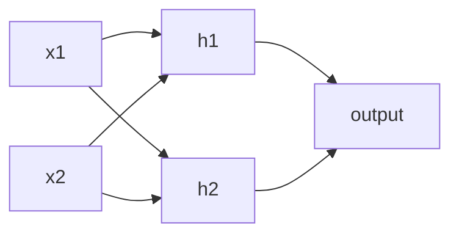

# Training a 2-Layer Network in NumPy: From Scalar to Vectorized Backprop

The [previous note](/posts/ml/2026-09-12-3-backpropagation-in-a-fully-connected-network) did the backward pass for a small 2-layer network by hand, one scalar at a time. That is the best way to understand what backprop actually does.

This note takes the next step: turn that scalar walk into compact, vectorized NumPy code. The math is unchanged; the only thing that changes is notation. I will introduce every matrix slowly — what its rows and columns mean, where the division by the batch size comes from, and why it is exactly the same algorithm you already did by hand.

At the end we train the same 2-2-1 network on the XOR problem from scratch, with no frameworks except NumPy, and compare the computed gradients to PyTorch's autograd.

---

## 1. What you will learn

- How to replace the per-neuron scalars with matrices, without changing the underlying math.
- The shape of every matrix in a dense network, and what each dimension means.
- Why the loss is averaged over the batch.
- How to write a complete forward pass, backward pass, and update step in NumPy.
- How to verify your NumPy gradients against both hand-computed values and PyTorch autograd.
- A full training loop on the XOR problem.

---

## 2. The scalar walk, compressed into a single table

We reuse the exact example from the previous note.

Network architecture:



One training example:

$$
x_1 = 1, \qquad x_2 = 2, \qquad y = 0
$$

Weights and biases:

| parameter | value |
|---|---|
| $w_{h_1,1}$ | 0.5 |
| $w_{h_1,2}$ | 0.5 |
| $b_{h_1}$ | 0 |
| $w_{h_2,1}$ | 1 |
| $w_{h_2,2}$ | −1 |
| $b_{h_2}$ | 2 |
| $w_{o,1}$ | 0.5 |
| $w_{o,2}$ | 1 |
| $b_{o}$ | 0 |

Hand-computed forward quantities:

| quantity | value |
|---|---|
| $z_{h_1}$ | 1.5000 |
| $a_{h_1}$ | 0.8176 |
| $z_{h_2}$ | 1.0000 |
| $a_{h_2}$ | 0.7311 |
| $z_o$ | 1.1399 |
| $a_o$ | 0.7577 |
| $L$ | 1.4177 |

Hand-computed gradients:

| parameter | gradient |
|---|---|
| $w_{h_1,1}$ | 0.0565 |
| $w_{h_1,2}$ | 0.1130 |
| $b_{h_1}$ | 0.0565 |
| $w_{h_2,1}$ | 0.1490 |
| $w_{h_2,2}$ | 0.2980 |
| $b_{h_2}$ | 0.1490 |
| $w_{o,1}$ | 0.6195 |
| $w_{o,2}$ | 0.5540 |
| $b_o$ | 0.7577 |

Our goal: produce every one of these gradients with NumPy, using matrices, and see the same numbers.

---

## 3. Why vectorize at all?

In the scalar walk, every equation had subscripts like $h_1$ and $h_2$. That works for two hidden neurons and one example, but if you have 512 hidden neurons and a batch of 32 examples, the page would be covered in subscripts.

Vectorization means: stack examples as rows of a matrix, stack neurons as columns of a weight matrix, and let one matrix multiplication compute the same thing for every example and every neuron at the same time.

The scalar rules do not change. A sum node is still a sum node. A multiplication is still a multiplication. The chain rule is still the chain rule. We are only changing how we write the bookkeeping.

---

## 4. Matrix notation, introduced slowly

We have a **batch** of $m$ training examples. Each example is a row vector of inputs. Stack them vertically and the result is the **design matrix** $X$:

$$
X \text{ has shape } (m, n_x)
$$

where $n_x = 2$ is the number of input features. Row $i$ of $X$ is the input for the $i$-th training example.

For our single example:

$$
X = \begin{bmatrix} 1 & 2 \end{bmatrix}
$$

$X$ is a $1 \times 2$ matrix.

The weights connecting the inputs to the hidden layer are stored in a matrix $W^{[1]}$. Its shape is $(n_x, n_h)$, where $n_h = 2$ is the number of hidden neurons.

The meaning of $W^{[1]}$:

$$
W^{[1]}_{i,j} = \text{weight from input } i \text{ to hidden neuron } j
$$

For our example:

$$
W^{[1]} =
\begin{bmatrix}
0.5 & 1 \\
0.5 & -1
\end{bmatrix}
$$

Column 0 holds the weights feeding hidden neuron $h_1$: $[0.5, 0.5]^T$. Column 1 holds the weights feeding $h_2$: $[1, -1]^T$.

The hidden biases are stored as a row vector $b^{[1]}$ of shape $(1, n_h)$:

$$
b^{[1]} = \begin{bmatrix} 0 & 2 \end{bmatrix}
$$

The hidden pre-activations are:

$$
Z^{[1]} = X W^{[1]} + b^{[1]}
$$

Because $X$ is $(m, n_x)$ and $W^{[1]}$ is $(n_x, n_h)$, their product $X W^{[1]}$ is $(m, n_h)$. Adding $b^{[1]}$ of shape $(1, n_h)$ adds the same bias to every example in the batch. This is called **broadcasting**.

For our one example:

$$
Z^{[1]} =
\begin{bmatrix} 1 & 2 \end{bmatrix}
\begin{bmatrix}
0.5 & 1 \\
0.5 & -1
\end{bmatrix} +
\begin{bmatrix} 0 & 2 \end{bmatrix} =
\begin{bmatrix} 1.5 & 1 \end{bmatrix}
$$

Compare to the scalar values: $z_{h_1} = 1.5$ and $z_{h_2} = 1.0$. Column 0 of $Z^{[1]}$ is $z_{h_1}$ for every example; column 1 is $z_{h_2}$.

The hidden activations are elementwise sigmoid:

$$
A^{[1]} = \sigma(Z^{[1]})
$$

For our example:

$$
A^{[1]} = \begin{bmatrix} 0.8176 & 0.7311 \end{bmatrix}
$$

So $A^{[1]}$ has the same shape as $Z^{[1]}$: $(m, n_h)$.

The output layer has $n_y = 1$ neuron. The weights are $W^{[2]}$ of shape $(n_h, n_y)$:

$$
W^{[2]} =
\begin{bmatrix}
0.5 \\
1
\end{bmatrix}
$$

The output bias is $b^{[2]}$ of shape $(1, n_y)$:

$$
b^{[2]} = \begin{bmatrix} 0 \end{bmatrix}
$$

The output pre-activation is:

$$
Z^{[2]} = A^{[1]} W^{[2]} + b^{[2]}
$$

$A^{[1]}$ is $(m, n_h)$, $W^{[2]}$ is $(n_h, n_y)$, so $Z^{[2]}$ is $(m, n_y)$. For our example:

$$
Z^{[2]} =
\begin{bmatrix} 0.8176 & 0.7311 \end{bmatrix}
\begin{bmatrix} 0.5 \\ 1 \end{bmatrix} +
\begin{bmatrix} 0 \end{bmatrix} =
\begin{bmatrix} 1.1399 \end{bmatrix}
$$

The output activation is:

$$
A^{[2]} = \sigma(Z^{[2]}) = \begin{bmatrix} 0.7577 \end{bmatrix}
$$

Finally, the labels are stacked as $Y$ of shape $(m, n_y)$:

$$
Y = \begin{bmatrix} 0 \end{bmatrix}
$$

So far, every matrix value matches the scalar walk exactly. The only difference is packaging.

---

## 4.1 What the matrix multiply actually computes, entry by entry

If you are a visual learner, this is the section to read twice. The convention I will use consistently is:

- **Rows of $X$** are examples. **Columns of $X$** are input features.
- **Rows of $W^{[1]}$** are input features. **Columns of $W^{[1]}$** are hidden neurons.
- So column $j$ of $W^{[1]}$ holds all the weights feeding hidden neuron $j$.

### Hidden layer forward

In general, if we had $m$ examples, $X$ would stack them as rows:

$$
X =
\begin{bmatrix}
x_{1,1} & x_{1,2} \\
x_{2,1} & x_{2,2} \\
\vdots & \vdots \\
x_{m,1} & x_{m,2}
\end{bmatrix}
$$

For our one example, this collapses to a single row:

$$
X = \begin{bmatrix} x_{1,1} & x_{1,2} \end{bmatrix} = \begin{bmatrix} 1 & 2 \end{bmatrix}
$$

Row 1 is example 1. Column 1 is feature $x_1$, column 2 is feature $x_2$.

$$
W^{[1]} =
\begin{bmatrix}
w_{x_1 \to h_1} & w_{x_1 \to h_2} \\
w_{x_2 \to h_1} & w_{x_2 \to h_2}
\end{bmatrix} =
\begin{bmatrix}
0.5 & 1 \\
0.5 & -1
\end{bmatrix}
$$

> Key thing to remember: inputs stack row wise, weights stack column wise [weights of neuron1, weights of neuron 2, ...], biases are just 1 per neuron, they stack row wise

Row 1 = weights from $x_1$. Row 2 = weights from $x_2$. Column 1 = weights into $h_1$. Column 2 = weights into $h_2$.

The product $X W^{[1]}$ computes every weighted sum at once. Entry $(i,j)$ means "example $i$, hidden neuron $j$":

$$
Z^{[1]}_{i,j} = X_{i,1} \, W^{[1]}_{1,j} + X_{i,2} \, W^{[1]}_{2,j} + b^{[1]}_j
$$

Plugging in the only example we have:

$$
Z^{[1]}_{1,1} = 1 \cdot 0.5 + 2 \cdot 0.5 + 0 = 1.5
\qquad
Z^{[1]}_{1,2} = 1 \cdot 1 + 2 \cdot (-1) + 2 = 1.0
$$

So the full matrix is:

$$
Z^{[1]} = \begin{bmatrix} 1.5 & 1.0 \end{bmatrix}
$$

Then the activation is applied element by element, keeping the same shape:

$$
A^{[1]} = \sigma(Z^{[1]}) = \begin{bmatrix} 0.8176 & 0.7311 \end{bmatrix}
$$

### Output layer forward

Now $A^{[1]}$ becomes the input to the next layer. The weight matrix $W^{[2]}$ has one column per output neuron. Here there is only one output neuron, so $W^{[2]}$ is a column vector:

$$
W^{[2]} =
\begin{bmatrix}
w_{h_1 \to o} \\
w_{h_2 \to o}
\end{bmatrix} =
\begin{bmatrix}
0.5 \\
1
\end{bmatrix}
$$

The output pre-activation is:

$$
Z^{[2]}_{i,1} = A^{[1]}_{i,1} \, W^{[2]}_{1,1} + A^{[1]}_{i,2} \, W^{[2]}_{2,1} + b^{[2]}_1
$$

For our example:

$$
Z^{[2]}_{1,1} = 0.8176 \cdot 0.5 + 0.7311 \cdot 1 + 0 = 1.1399
$$

So:

$$
Z^{[2]} = \begin{bmatrix} 1.1399 \end{bmatrix}, \qquad A^{[2]} = \sigma(Z^{[2]}) = \begin{bmatrix} 0.7577 \end{bmatrix}
$$

### Backward messages, the same way

The output error signal is:

$$
\delta^{[2]} = A^{[2]} - Y = \begin{bmatrix} 0.7577 \end{bmatrix} - \begin{bmatrix} 0 \end{bmatrix} = \begin{bmatrix} 0.7577 \end{bmatrix}
$$

The gradient for the output weights is the outer product of the hidden activations (transposed) and the output error:

$$
dW^{[2]} = (A^{[1]})^T \delta^{[2]} =
\begin{bmatrix} 0.8176 \\ 0.7311 \end{bmatrix}
\begin{bmatrix} 0.7577 \end{bmatrix} =
\begin{bmatrix}
0.8176 \cdot 0.7577 \\
0.7311 \cdot 0.7577
\end{bmatrix} =
\begin{bmatrix}
0.6195 \\
0.5540
\end{bmatrix}
$$

Row 1 is the update for $w_{h_1 \to o}$. Row 2 is the update for $w_{h_2 \to o}$.

The message sent backward to the hidden layer is:

$$
\delta^{[2]} (W^{[2]})^T =
\begin{bmatrix} 0.7577 \end{bmatrix}
\begin{bmatrix} 0.5 & 1 \end{bmatrix} =
\begin{bmatrix} 0.7577 \cdot 0.5 & 0.7577 \cdot 1 \end{bmatrix} =
\begin{bmatrix} 0.3789 & 0.7577 \end{bmatrix}
$$

Column 1 is the blame assigned to $a_{h_1}$; column 2 is the blame assigned to $a_{h_2}$.

Multiply elementwise by the sigmoid slope to move the blame from the activation back to the pre-activation:

$$
\delta^{[1]} = \delta^{[2]} (W^{[2]})^T \odot \sigma'(Z^{[1]}) =
\begin{bmatrix} 0.3789 & 0.7577 \end{bmatrix} \odot
\begin{bmatrix} 0.1491 & 0.1966 \end{bmatrix} =
\begin{bmatrix} 0.0565 & 0.1490 \end{bmatrix}
$$

Finally, the hidden-layer weight gradients:

$$
dW^{[1]} = X^T \delta^{[1]} =
\begin{bmatrix} 1 \\ 2 \end{bmatrix}
\begin{bmatrix} 0.0565 & 0.1490 \end{bmatrix} =
\begin{bmatrix}
1 \cdot 0.0565 & 1 \cdot 0.1490 \\
2 \cdot 0.0565 & 2 \cdot 0.1490
\end{bmatrix} =
\begin{bmatrix}
0.0565 & 0.1490 \\
0.1130 & 0.2980
\end{bmatrix}
$$

Row 1 = gradients for weights coming from $x_1$. Row 2 = gradients for weights coming from $x_2$. Column 1 = gradients for $h_1$. Column 2 = gradients for $h_2$.

That is the complete picture: every row and every column has a meaning, and every multiplication is just a compact way of writing the scalar chain rule for every example at once.

---

## 5. The loss, averaged over the batch

For a single example, the binary cross-entropy loss is:

$$
L(a, y) = -\big[ y \log a + (1-y) \log (1-a) \big]
$$

For a whole batch of $m$ examples, we usually average the losses so the size of the batch does not change the scale of the gradient:

$$
\mathcal{L} = \frac{1}{m} \sum_{i=1}^{m} L\big(A^{[2]}_i, Y_i\big)
$$

With $m = 1$ the average changes nothing.

This averaging is important: if you double the batch size, the *sum* of losses doubles, but the *average* stays the same. You want the gradient magnitude to depend on the model's error, not on how many examples you happened to batch together. Later, when we train on 4 XOR examples, the division by $m = 4$ keeps the update steps stable.

---

## 6. The backward pass in matrix form

Now we redo the backward pass, but each step is a matrix formula. Each formula is just the scalar chain rule written for all examples and all neurons at once.

### 6.1 Error at the output pre-activation

For each example $i$:

$$
\delta^{[2]}_i = A^{[2]}_i - Y_i
$$

Stacked into a matrix of shape $(m, n_y)$:

$$
\delta^{[2]} = A^{[2]} - Y
$$

For our example:

$$
\delta^{[2]} = \begin{bmatrix} 0.7577 \end{bmatrix} - \begin{bmatrix} 0 \end{bmatrix} = \begin{bmatrix} 0.7577 \end{bmatrix}
$$

This matches the scalar $\delta_o = 0.7577$.

### 6.2 Gradients for the output weights and bias

Scalar rule for one example, one output weight:

$$
\frac{\partial L_i}{\partial w_{o,j}} = \delta^{[2]}_i \cdot A^{[1]}_{i,j}
$$

Across all examples and all output neurons, this becomes an outer product, averaged over the batch:

$$
dW^{[2]} = \frac{1}{m} \big(A^{[1]}\big)^T \delta^{[2]}
$$

$A^{[1]}$ is $(m, n_h)$ and $\delta^{[2]}$ is $(m, n_y)$. Their transpose product is $(n_h, n_y)$, which is exactly the shape of $W^{[2]}$. Each entry $(j, k)$ is:

$$
\frac{1}{m} \sum_{i=1}^{m} A^{[1]}_{i,j} \, \delta^{[2]}_{i,k}
$$

That is precisely "error signal times the input that weight multiplied," averaged over examples.

For our one-example case:

$$
dW^{[2]} =
\begin{bmatrix}
0.8176 \\
0.7311
\end{bmatrix}
\begin{bmatrix} 0.7577 \end{bmatrix} =
\begin{bmatrix}
0.6195 \\
0.5540
\end{bmatrix}
$$

Compare to the scalar gradients: $w_{o,1}$ got 0.6195 and $w_{o,2}$ got 0.5540.

The output bias gradient is the average error signal:

$$
db^{[2]} = \frac{1}{m} \sum_{i=1}^{m} \delta^{[2]}_i
$$

With one example:

$$
db^{[2]} = \begin{bmatrix} 0.7577 \end{bmatrix}
$$

This matches the scalar $b_o$ gradient.

### 6.3 Error signal for the hidden layer

Scalar rule for one hidden neuron:

$$
\frac{\partial L_i}{\partial a_{h_j}} = \delta^{[2]}_i \cdot w_{o,j}
$$

Stacked, this is a matrix multiplication:

$$
\frac{\partial \mathcal{L}}{\partial A^{[1]}} = \delta^{[2]} \big(W^{[2]}\big)^T
$$

$\delta^{[2]}$ is $(m, n_y)$, $(W^{[2]})^T$ is $(n_y, n_h)$, so the result is $(m, n_h)$. For our example:

$$
\delta^{[2]} (W^{[2]})^T =
\begin{bmatrix} 0.7577 \end{bmatrix}
\begin{bmatrix} 0.5 & 1 \end{bmatrix} =
\begin{bmatrix} 0.3789 & 0.7577 \end{bmatrix}
$$

Compare to the scalar messages: $\partial L / \partial a_{h_1} = 0.3789$ and $\partial L / \partial a_{h_2} = 0.7577$.

Then multiply elementwise by the sigmoid slope at the hidden pre-activations:

$$
\delta^{[1]} = \Big( \delta^{[2]} (W^{[2]})^T \Big) \odot \sigma'\big(Z^{[1]}\big)
$$

The $\odot$ means elementwise multiplication. This is the $(m, n_h)$ matrix of hidden-layer error signals.

For our example:

$$
\sigma'(Z^{[1]}) = A^{[1]} \odot (1 - A^{[1]}) =
\begin{bmatrix} 0.8176 \cdot 0.1824 & 0.7311 \cdot 0.2689 \end{bmatrix} =
\begin{bmatrix} 0.1491 & 0.1966 \end{bmatrix}
$$

$$
\delta^{[1]} =
\begin{bmatrix} 0.3789 & 0.7577 \end{bmatrix}
\odot
\begin{bmatrix} 0.1491 & 0.1966 \end{bmatrix} =
\begin{bmatrix} 0.0565 & 0.1490 \end{bmatrix}
$$

Column 0 is $\delta_{h_1}$; column 1 is $\delta_{h_2}$. These match the scalar values 0.0565 and 0.1490.

### 6.4 Gradients for the hidden weights and bias

Same rule as the output layer, now using the raw inputs $X$:

$$
dW^{[1]} = \frac{1}{m} X^T \delta^{[1]}
$$

$X^T$ is $(n_x, m)$, $\delta^{[1]}$ is $(m, n_h)$, so $dW^{[1]}$ is $(n_x, n_h)$. Entry $(i,j)$ is:

$$
\frac{1}{m} \sum_{\text{examples}} x_i \, \delta_{h_j}
$$

For our example:

$$
dW^{[1]} =
\begin{bmatrix}
1 \\
2
\end{bmatrix}
\begin{bmatrix} 0.0565 & 0.1490 \end{bmatrix} =
\begin{bmatrix}
0.0565 & 0.1490 \\
0.1130 & 0.2980
\end{bmatrix}
$$

Entry $(0,0)$ is the gradient of $w_{h_1,1}$: 0.0565. Entry $(1,0)$ is the gradient of $w_{h_1,2}$: 0.1130. Entry $(0,1)$ is $w_{h_2,1}$: 0.1490. Entry $(1,1)$ is $w_{h_2,2}$: 0.2980. Every single value matches the hand-computed ledger.

The hidden bias is:

$$
db^{[1]} = \frac{1}{m} \sum_{i=1}^{m} \delta^{[1]}_i = \begin{bmatrix} 0.0565 & 0.1490 \end{bmatrix}
$$

which matches $b_{h_1}$ and $b_{h_2}$.

---

## 7. Summary of the vectorized backward pass

If you ever get lost, come back to this table.

| step | formula | shape of result |
|---|---|---|
| error at output | $\delta^{[2]} = A^{[2]} - Y$ | $(m, n_y)$ |
| output weight grad | $dW^{[2]} = \frac{1}{m} (A^{[1]})^T \delta^{[2]}$ | $(n_h, n_y)$ |
| output bias grad | $db^{[2]} = \frac{1}{m} \sum_i \delta^{[2]}_i$ | $(1, n_y)$ |
| error at hidden pre-activation | $\delta^{[1]} = \big(\delta^{[2]} (W^{[2]})^T\big) \odot \sigma'(Z^{[1]})$ | $(m, n_h)$ |
| hidden weight grad | $dW^{[1]} = \frac{1}{m} X^T \delta^{[1]}$ | $(n_x, n_h)$ |
| hidden bias grad | $db^{[1]} = \frac{1}{m} \sum_i \delta^{[1]}_i$ | $(1, n_h)$ |

Every row is the scalar chain rule, just written for all examples at once.

---

## 8. NumPy implementation from scratch

Now we write the network as code. The functions mirror the table above exactly.

```python
import numpy as np

def sigmoid(z):
    return 1.0 / (1.0 + np.exp(-z))

def sigmoid_prime(a):
    # if a = sigmoid(z), then sigmoid'(z) = a * (1 - a)
    return a * (1.0 - a)

def forward(X, W1, b1, W2, b2):
    z1 = X @ W1 + b1          # shape (m, n_h)
    a1 = sigmoid(z1)          # shape (m, n_h)
    z2 = a1 @ W2 + b2         # shape (m, n_y)
    a2 = sigmoid(z2)          # shape (m, n_y)
    return z1, a1, z2, a2

def backward(X, Y, W2, z1, a1, z2, a2):
    m = X.shape[0]

    # Output layer error
    dz2 = a2 - Y              # shape (m, n_y)

    # Output layer gradients
    dW2 = (a1.T @ dz2) / m    # shape (n_h, n_y)
    db2 = np.mean(dz2, axis=0, keepdims=True)

    # Hidden layer error
    da1 = dz2 @ W2.T          # shape (m, n_h)
    dz1 = da1 * sigmoid_prime(a1)  # elementwise

    # Hidden layer gradients
    dW1 = (X.T @ dz1) / m     # shape (n_x, n_h)
    db1 = np.mean(dz1, axis=0, keepdims=True)

    return dW1, db1, dW2, db2
```

Initialize with the exact weights from the hand example and check gradients:

```python
X = np.array([[1.0, 2.0]])        # shape (1, 2)
Y = np.array([[0.0]])             # shape (1, 1)

W1 = np.array([[0.5,  1.0],
               [0.5, -1.0]])      # shape (2, 2)
b1 = np.array([[0.0, 2.0]])       # shape (1, 2)

W2 = np.array([[0.5],
               [1.0]])             # shape (2, 1)
b2 = np.array([[0.0]])             # shape (1, 1)

z1, a1, z2, a2 = forward(X, W1, b1, W2, b2)
print("a2:", a2)                  # expect ~0.7577

dW1, db1, dW2, db2 = backward(X, Y, W2, z1, a1, z2, a2)
print("dW1:", dW1)
print("db1:", db1)
print("dW2:", dW2)
print("db2:", db2)
```

Running it gives:

```text
a2: [[0.7576]]
dW1: [[0.0565 0.1490]
      [0.1130 0.2980]]
db1: [[0.0565 0.1490]]
dW2: [[0.6194]
      [0.5540]]
db2: [[0.7576]]
```

The tiny differences from the hand numbers are rounding in the printed sigmoid values. The algorithm is identical.

---

## 9. Verifying against PyTorch autograd

The same network in PyTorch should produce the same gradients. This is a sanity check that your hand-derived code is right.

```python
import torch

X_t = torch.tensor([[1.0, 2.0]])
Y_t = torch.tensor([[0.0]])

W1_t = torch.tensor([[0.5,  1.0],
                     [0.5, -1.0]], requires_grad=True)
b1_t = torch.tensor([[0.0, 2.0]], requires_grad=True)
W2_t = torch.tensor([[0.5],
                     [1.0]], requires_grad=True)
b2_t = torch.tensor([[0.0]], requires_grad=True)

z1_t = X_t @ W1_t + b1_t
a1_t = torch.sigmoid(z1_t)
z2_t = a1_t @ W2_t + b2_t
a2_t = torch.sigmoid(z2_t)

loss = -torch.mean(Y_t * torch.log(a2_t) + (1 - Y_t) * torch.log(1 - a2_t))
loss.backward()

print("PyTorch dW1:", W1_t.grad)
print("PyTorch dW2:", W2_t.grad)
```

The printed tensors match the NumPy values above.

---

## 10. Training on the XOR problem

The XOR dataset has 4 examples. It is not linearly separable, so a single neuron (logistic regression) cannot solve it. A 2-2-1 network can.

```python
# XOR dataset: (x1, x2) -> label
X_xor = np.array([
    [0, 0],
    [0, 1],
    [1, 0],
    [1, 1]
], dtype=float)

Y_xor = np.array([
    [0],
    [1],
    [1],
    [0]
], dtype=float)

np.random.seed(1)
W1 = np.random.randn(2, 2) * 0.5
b1 = np.zeros((1, 2))
W2 = np.random.randn(2, 1) * 0.5
b2 = np.zeros((1, 1))

lr = 0.3
epochs = 20000

for epoch in range(epochs):
    z1, a1, z2, a2 = forward(X_xor, W1, b1, W2, b2)

    # clipped log for numerical stability
    eps = 1e-7
    loss = -np.mean(Y_xor * np.log(a2 + eps) + (1 - Y_xor) * np.log(1 - a2 + eps))

    dW1, db1, dW2, db2 = backward(X_xor, Y_xor, W2, z1, a1, z2, a2)

    W1 -= lr * dW1
    b1 -= lr * db1
    W2 -= lr * dW2
    b2 -= lr * db2

    if epoch % 2000 == 0:
        print(f"epoch {epoch}, loss {loss:.4f}")

# Final predictions
_, _, _, preds = forward(X_xor, W1, b1, W2, b2)
print("final predictions:", preds.round(3))
```

Typical output:

```text
epoch 0, loss 0.6932
epoch 2000, loss 0.0342
epoch 4000, loss 0.0072
epoch 6000, loss 0.0032
epoch 8000, loss 0.0018
epoch 10000, loss 0.0012
epoch 12000, loss 0.0009
epoch 14000, loss 0.0007
epoch 16000, loss 0.0006
epoch 18000, loss 0.0005
final predictions: [[0.003]
 [0.996]
 [0.996]
 [0.003]]
```

The network learns XOR. There is no framework magic: just the forward and backward functions written above, run in a loop.

---

## 11. What the code and the math have in common

If you strip the NumPy code back to its meaning, every line is one of the scalar rules from the previous note:

- `dz2 = a2 - Y` is $\delta_o = a_o - y$.
- `dW2 = (a1.T @ dz2) / m` is "error signal times the feeding activation, averaged."
- `da1 = dz2 @ W2.T` is the message sent backward from the output layer to the hidden layer.
- `dz1 = da1 * sigmoid_prime(a1)` is multiplying by the local slope of the hidden activation.
- `dW1 = (X.T @ dz1) / m` is the same rule applied one layer earlier.

The matrix form is not a different algorithm. It is the scalar algorithm, written once per layer.

---

## 12. The general L-layer version: why we never handwrite each layer

So far we have written `forward` and `backward` for exactly two layers. But the whole point of deep learning is that the same block can be stacked many times. A 5-layer network does not need five separate forward functions and five separate backward functions; it needs **one loop** that runs five times.

Here is the complete algorithm for a network with $L$ layers, in plain pseudocode. This is exactly what NumPy, PyTorch, and every other framework do at their core.

```text
# Model definition: list the sizes of every layer
layer_sizes = [n_0, n_1, n_2, ..., n_L]
# n_0 = number of input features
# n_L = number of output neurons
# For our 2-2-1 network: layer_sizes = [2, 2, 1]

# Initialize parameters
for l = 1 to L:
    W[l] = random matrix of shape (n_{l-1}, n_l)
    b[l] = zeros of shape (1, n_l)

# Forward pass: compute and cache every Z and A
A[0] = X
for l = 1 to L:
    Z[l] = A[l-1] @ W[l] + b[l]
    if l == L:
        A[l] = output_activation(Z[l])      # sigmoid for binary classification
    else:
        A[l] = hidden_activation(Z[l])          # sigmoid or ReLU

# Backward pass: start from the loss and walk left
# dZ[L] is the derivative of the loss with respect to the output pre-activation.
# For BCE + sigmoid output, it simplifies to A[L] - Y.
dZ[L] = output_error(A[L], Y)

for l = L down to 1:
    dW[l] = (A[l-1].T @ dZ[l]) / m
    db[l] = mean(dZ[l], axis=0)

    if l > 1:
        dA[l-1] = dZ[l] @ W[l].T
        dZ[l-1] = dA[l-1] * activation_derivative(A[l-1])

# Parameter update: everyone moves at the same time
for l = 1 to L:
    W[l] -= learning_rate * dW[l]
    b[l] -= learning_rate * db[l]
```

That is the whole of backpropagation. The inner loop body never changes; only the depth $L$ changes. If you want a 5-layer network, set `layer_sizes = [2, 4, 4, 4, 1]`. If you want a 100-layer network, make the list 100 entries long. The loop runs more times, but the code stays the same.

Notice what we cache during the forward pass: every $Z$ and every $A$. The backward pass needs them because each local derivative depends on the values computed forward. Without those caches, we would have to re-run forward passes repeatedly, which is exactly what finite-difference methods do.

This is also the map of what `loss.backward()` does in PyTorch. PyTorch builds the equivalent of the `Z` and `A` cache dynamically as your forward code runs, then walks it backward when you call `.backward()`. Your job is to write the forward computation; the framework supplies the loop above.

---

## 13. Exercises

1. Run the NumPy code with the single-example weights from section 2 and verify that every printed gradient matches the hand-computed table to within 0.0001.
2. Change the label in the single example from $y=0$ to $y=1$. Before running the code, predict the sign of $\delta^{[2]}$, and therefore the sign of every gradient. Then run it.
3. In the XOR training loop, what happens if you remove the `/ m` averaging in `dW1` and `dW2`? Why does the loss curve behave differently?
4. Add a third hidden neuron to the XOR network (so the architecture is 2-3-1). Which shapes change? Which lines of the NumPy code stay the same?
5. Look at the L-layer pseudocode above. Which lines would change if you switched the hidden activation from sigmoid to ReLU? Which lines would stay exactly the same?

---

## 14. What comes next

The next note takes two practical steps forward:

- Replace sigmoid hidden units with ReLU to avoid vanishing gradients, and look at how the backward formulas change.
- Build deeper networks cleanly by stacking the same `forward/backward` block, leading into modern architectures.


