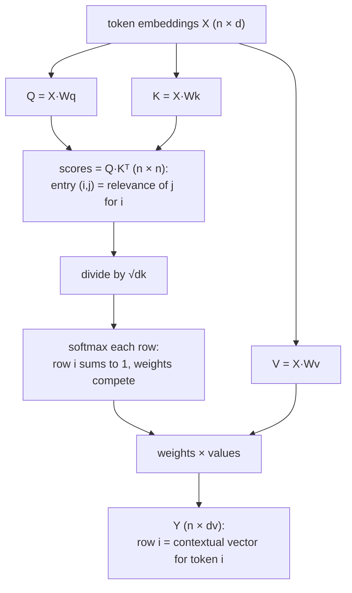

# Attention: Turning Token Vectors into Context Vectors

The [embeddings note](/posts/ml/2026-09-14-4-embeddings-from-one-hot-to-learned-representations) ended with an honest limitation: a token's embedding is one fixed row of a learned matrix. The word "bank" gets the same vector in "river bank" and "investment bank". Everything the model can possibly know about "bank itself" is frozen into that row at training time.

But meaning is contextual. When a model processes a sentence, what it needs at the position of "bank" is not "the generic bank vector" but "the vector of bank *as it appears in this sentence*". Attention is the mechanism that builds that second thing from the first.

Everything in this note is assembled from pieces you already own: matrix multiplication, softmax, embeddings. There is no new calculus; the whole operation is two matrix multiplies, a scale, a softmax, and one more matrix multiply. What's new is the *interpretation* — what the matrices mean.

---

## 1. The one-sentence version

For every token in a sequence, attention computes:

**output vector of token $i$ = a weighted average of every token's "value" vector, where the weight on token $j$ is how relevant token $j$ is to token $i$, measured by similarity and normalized by a softmax.**

That is the entire mechanism. The rest of the note is: where do the "value", "relevance", and "similarity" vectors come from, why the design choices are what they are, and what actually happens numerically.

Notice instantly how this solves the embedding problem: "bank" keeps its fixed embedding, but its *output* from an attention layer is a mixture of its own vector with its neighbors' vectors — so in "river bank", its output gets pulled toward "river", and in "investment bank", toward "investment". The row in the embedding matrix is static; the attention output is contextual.

---

## 2. Queries, keys, and values

Why are there three vectors per token instead of one? Because a token plays three completely different *roles* in the operation, and a single vector can't cleanly play all three:

- The **query** ($q_i$) is "what token $i$ is looking for". It exists to be compared *against* other tokens.
- The **key** ($k_j$) is "what token $j$ has to offer / how token $j$ advertises itself". It exists to be compared *by* others.
- The **value** ($v_j$) is "what token $j$ actually sends over, if attended to". It exists to be *mixed*.

An intuitive database analogy, worth one sentence: a query searches, keys get matched, values get retrieved. The match scores key-vs-query decide *how much* of each value actually arrives.

Each role vector is a linear projection of the token's embedding $x_i$, with three learned weight matrices:

$$
q_i = x_i W_Q, \qquad k_i = x_i W_K, \qquad v_i = x_i W_V
$$

$W_Q, W_K, W_V$ are ordinary $(d, d_k)$, $(d, d_k)$, $(d, d_v)$ matrices, learned by backprop exactly like every other weight matrix in these notes. Queries and keys must have the same dimension $d_k$ because they get dot-producted; values can have their own dimension $d_v$.

Why not just use $x_i$ directly for all three roles? Two reasons, and both are worth holding onto:

1. **Asymmetry.** "Looking for" and "containing" are not the same thing. The token "it" is a terrible *thing to be looked for about* (vague) but an excellent *thing to attend to* (it resolves references). If $q$ and $k$ were the same vector, similarity would be symmetric — token A would find token B exactly as relevant as B finds A. Language doesn't work that way.
2. **Routability.** The projections let training rewire the geometry: even if two tokens' embeddings are not especially close, their keys can be moved close to the queries that need them. The raw embedding stores "what the token is"; the projections store "what it's good for and who it's good to listen to."

For the demo below we will just set $W_Q = W_K = W_V = I$ and pretend q = k = v = x. That's purely to expose the mechanics; remember real networks learn three non-identity projections.

---

## 3. The full formula, then a numeric walkthrough

Stack all tokens' embeddings as rows of a matrix $X$ (shape $n \times d$, $n$ tokens). Then, in one line:

$$
Q = XW_Q, \qquad K = XW_K, \qquad V = XW_V
$$
$$
\operatorname{Attention}(Q, K, V) = \operatorname{softmax}\!\left(\frac{QK^T}{\sqrt{d_k}}\right) V
$$

Read it right to left like the previous notes:

1. $QK^T$ scores every query against every key. Shape $(n, n)$. Entry $(i, j)$ = "how much token $i$ should care about token $j$".
2. $\sqrt{d_k}$ divides every score; section 4 explains why (your softmax saturation insight returns here).
3. The softmax is applied **row by row**: each row becomes a probability distribution over the $n$ tokens. Row $i$ sums to 1. Right away this echoes your softmax-note insight: the weights *compete* through a shared denominator — attending more to one token costs attention somewhere else.
4. Multiplying by $V$ makes row $i$ of the output the weighted average of all value vectors, using row $i$'s distribution. Output shape $(n, d_v)$.

### Numbers: "cat", "dog", "phone"

Three tokens, $d = 2$, identity projections. Rows of $X$:

$$
X = \begin{bmatrix} 1.0 & 0.5 \\ 0.8 & 0.6 \\ -0.5 & 1.0 \end{bmatrix}
\begin{matrix} \leftarrow \text{cat} \\ \leftarrow \text{dog} \\ \leftarrow \text{phone} \end{matrix}
$$

I chose the numbers so cat and dog are close, phone is off on its own — as if embedding training had already made animal words neighborly.

With identity projections, the score matrix is just $XX^T$, dot products of every pair:

$$
QK^T = XX^T = \begin{bmatrix}
1.25 & 1.10 & 0.00 \\
1.10 & 1.00 & 0.20 \\
0.00 & 0.20 & 1.25
\end{bmatrix}
$$

(Read entry (cat, dog): $1.0 \cdot 0.8 + 0.5 \cdot 0.6 = 0.8 + 0.30 = 1.10$.)

Scale by $\sqrt{d_k} = \sqrt{2} \approx 1.414$:

$$
\frac{XX^T}{\sqrt{2}} = \begin{bmatrix}
0.884 & 0.778 & 0.000 \\
0.778 & 0.707 & 0.141 \\
0.000 & 0.141 & 0.884
\end{bmatrix}
$$

Softmax each row independently. Row "cat" exponentials: $e^{0.884} = 2.42$, $e^{0.778} = 2.18$, $e^{0} = 1.00$; sum $5.60$; so:

$$
\text{cat's attention} = (0.43,\ 0.39,\ 0.18)
$$

cat keeps 43% on itself, pulls 39% from dog, takes only 18% from phone. Now the output row for "cat" is that mixture of the *value* vectors:

$$
y_{\text{cat}} = 0.43 \cdot [1.0,\ 0.5] \;+\; 0.39 \cdot [0.8,\ 0.6] \;+\; 0.18 \cdot [-0.5,\ 1.0] = [0.65,\ 0.63]
$$

Compare to cat's input vector $[1.0,\ 0.5]$: after attention, cat's representation moved substantially toward dog's vector $[0.8, 0.6]$ — the context reshaped the token. Had the sentence been "the cat scratched the phone", the third column would have pulled the vector somewhere else. One embedding row in, arbitrary context-sensitive vectors out. That is the entire trick.

Computing every *row* in the same softmax gives the whole output in one batched operation — the matrix form is exactly our old layer form, just with a score matrix in the middle.

---

## 4. Why the $\sqrt{d_k}$ divider: softmax saturation returns

Dot products of vectors with independent roughly unit-variance entries have mean 0 and *variance equal to $d_k$*. So with $d_k = 512$ — a real Transformer number — raw scores spread out over something like $\pm 22$ or wider. Feed logits of size 20 into softmax and the output is essentially a one-hot: the top logit gets $\sim 1$, everything else $\sim 0$.

And note what our softmax note told us about that regime: softmax near one-hot has **vanishingly small gradients** — the Jacobian terms $p_j(\delta_{ij} - p_i)$ collapse when every $p$ is 0 or 1. An attention layer whose weights saturate learns nothing about whom to attend to; the routing is stuck wherever initialization put it.

Dividing by $\sqrt{d_k}$ keeps scores at unit-ish width regardless of $d_k$, keeping softmax in its responsive middle zone. It's the *same* gradient-survival reasoning as the activation-function note, one level up: you don't just want nonlinearities alive, you want softmax's soft zone to stay soft.

---

## 5. What attention gives you that plain per-token layers can't

A few properties that follow directly from the formula, each worth a moment:

**1. Content-based routing.** Information moves between tokens based on what they *mean*, not where they sit. Token 1 and token 49 can exchange information as easily as adjacent tokens.

**2. Constant path length.** In an RNN, information from token 1 to token 49 travels through 48 sequential hidden states; each hop is its own nonlinear transformation, and errors find their way back through a 48-deep chain. In attention, every pair of positions communicates in **one** hop — the gradient path is one step. The vanishing-gradient enemy shrinks from path-length-dependent to a fixed radius. (A deep consequence — we will use it in the LM note.)

**3. The weights are interpretable.** Each attention row is literally a distribution over tokens. That has made attention rows the main (though imperfect) peephole for "what is the model looking at".

**4. Sets, not sequences.** Nothing in the formula knows which token came first. Permute the input rows of $X$ and the outputs permute identically — attention is *permutation equivariant*: it treats the sequence as a bag of tokens with affinities. That's great for set-like inputs and a true bug for language, whose meaning is bound up in order ("dog bites man" ≠ "man bites dog"). Fixing that is positional encoding, coming in the next note.

---

## 6. Self-attention vs cross-attention, in one breath

"Self-attention" is the version in this note: $Q$, $K$, $V$ all come from the *same* sequence, so every token consults its own sequence-mates. "Cross-attention" is the same formula with $Q$ from one sequence and $K$, $V$ from another — e.g., a translation decoder's English queries attending to French keys/values. Mechanism identical, wiring different.

---

## 7. Stepping back: what got added to our mental model

Before this note, a network processed each input independently: one forward pass per example, no cross-talk. Now the "examples" (tokens) talk to each other *inside* the layer. That's the single conceptual leap between "deep feedforward net" and "transformer". Multi-head attention and the rest of the Transformer block are engineering around this core — which is the next note.

Notice also what this did **not** require: no new gradient formulas. Attention is dot products (our weighted-sum gradients), softmax (we know its Jacobian), and a weighted average (our mixing gradients). The backward pass machinery we already wrote handles all of it; each token's $q$, $k$, and $v$ gets gradient contributions from every row that referenced it, summed, exactly like our embeddings note's "row gradient = sum of the messages of the examples that used the row". The fully general backward loop from the NumPy note does the rest.

---

## 8. Exercises — reasoning only

1. In the numeric example, cat assigned itself weight 0.43 even though "cat" presumably needs context, not self-echo. Argue whether high self-weight is (a) a failure the projection matrices will fix, or (b) a correct default. What would you expect trained $W_Q, W_K$ to learn about diagonal scores?
2. Suppose I double every embedding (twice the magnitude). What happens to scaled scores, to softmax output, and thereby to attention outputs? Use this to explain why training stability arguments keep coming back to normalization.
3. One of the rows of an attention weight matrix is exactly $(1/n, 1/n, \dots, 1/n)$ — perfectly uniform. Describe what that token's "current belief about what to consult" looks like, and whether that row is informationally useless or meaningful.
4. Explain why row-wise softmax, not column-wise. Describe in one sentence what breaks semantically if I normalize columns instead.
5. It is often said "attention is looking up a soft dictionary." Map each of Q, K, V, scores, weights, output onto database terms, and then point to the precise step where "hard lookup" became "soft lookup" (and why that step is what makes the whole thing trainable end-to-end by gradient descent).
6. Argue from permutation equivariance that no amount of attention training, using embeddings alone, can teach a transformer the difference between "the dog bit the man" and "the man bit the dog". Where exactly in the pipeline would the information have to be injected?
7. The dot product $q \cdot k$ large means $q$ and $k$ point the same way. Is "queries and keys pointing the same way" a *good* property to maximize in general between two tokens *x* and *y*? Why might asymmetric projections beat symmetric similarity? (Hint: pronouns.)

---

## 9. What comes next

One attention head can track one pattern of relevance at a time. Language needs several — "who is the subject?", "who does 'it' refer to?", "what's the verb's tense?" — simultaneously. The [next note](/posts/ml/2026-09-20-2-the-transformer-block) covers multi-head attention (parallel heads on subspaces), then assembles the full Transformer block around it: residual connections, layer norm, the feedforward network, the causal mask for generation, and positional encoding — the fix for the order-blindness you just derived.
