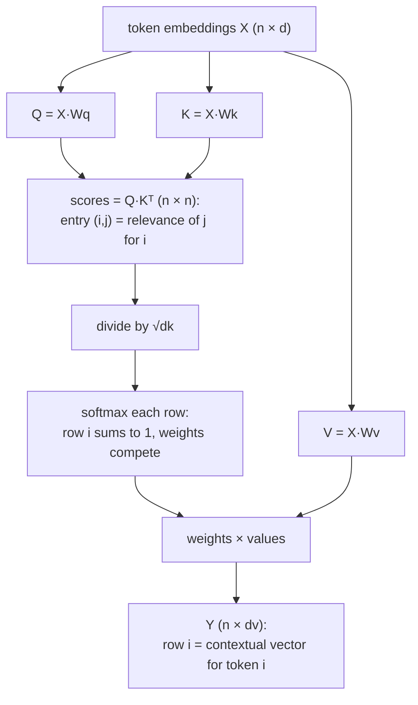

# Attention: Turning Token Vectors into Context Vectors

The [embeddings note](/posts/ml/2026-09-14-4-embeddings-from-one-hot-to-learned-representations) ended with an honest limitation: a token's embedding is one fixed row of a learned matrix. The word "bank" gets the same vector in "river bank" and "investment bank". Everything the model can possibly know about "bank itself" is frozen into that row at training time.

But meaning is contextual. When a model processes a sentence, what it needs at the position of "bank" is not "the generic bank vector" but "the vector of bank *as it appears in this sentence*". Attention is the mechanism that builds that second thing from the first.

Everything in this note is assembled from pieces you already own: matrix multiplication, softmax, embeddings. There is no new calculus; the whole operation is two matrix multiplies, a scale, a softmax, and one more matrix multiply. What's new is the *interpretation* — what the matrices mean.

---

## 1. The one-sentence version

For every token in a sequence, attention computes:

**output vector of token $i$ = a weighted average of every token's "value" vector, where the weight on token $j$ is how relevant token $j$ is to token $i$, measured by similarity and normalized by a softmax.**

That is the entire mechanism. The rest of the note is: where do the "value", "relevance", and "similarity" vectors come from, why the design choices are what they are, and what actually happens numerically.

Notice instantly how this solves the embedding problem: "bank" keeps its fixed embedding, but its *output* from an attention layer is a mixture of its own vector with its neighbors' vectors — so in "river bank", its output gets pulled toward "river", and in "investment bank", toward "investment". The row in the embedding matrix is static; the attention output is contextual.

---

## 2. Queries, keys, and values

Why are there three vectors per token instead of one? Because a token plays three completely different *roles* in the operation, and a single vector can't cleanly play all three:

- The **query** ($q_i$) is "what token $i$ is looking for". It exists to be compared *against* other tokens.
- The **key** ($k_j$) is "what token $j$ has to offer / how token $j$ advertises itself". It exists to be compared *by* others.
- The **value** ($v_j$) is "what token $j$ actually sends over, if attended to". It exists to be *mixed*.

An intuitive database analogy, worth one sentence: a query searches, keys get matched, values get retrieved. The match scores key-vs-query decide *how much* of each value actually arrives.

Each role vector is a linear projection of the token's embedding $x_i$, with three learned weight matrices:

$$
q_i = x_i W_Q, \qquad k_i = x_i W_K, \qquad v_i = x_i W_V
$$

$W_Q, W_K, W_V$ are ordinary $(d, d_k)$, $(d, d_k)$, $(d, d_v)$ matrices, learned by backprop exactly like every other weight matrix in these notes. Queries and keys must have the same dimension $d_k$ because they get dot-producted; values can have their own dimension $d_v$.

Why not just use $x_i$ directly for all three roles? Two reasons, and both are worth holding onto:

1. **Asymmetry.** "Looking for" and "containing" are not the same thing. The token "it" is a terrible *thing to be looked for about* (vague) but an excellent *thing to attend to* (it resolves references). If $q$ and $k$ were the same vector, similarity would be symmetric — token A would find token B exactly as relevant as B finds A. Language doesn't work that way.
2. **Routability.** The projections let training rewire the geometry: even if two tokens' embeddings are not especially close, their keys can be moved close to the queries that need them. The raw embedding stores "what the token is"; the projections store "what it's good for and who it's good to listen to."

For the demo below we will just set $W_Q = W_K = W_V = I$ and pretend q = k = v = x. That's purely to expose the mechanics; remember real networks learn three non-identity projections.

---

## 3. The full formula, then a numeric walkthrough

Stack all tokens' embeddings as rows of a matrix $X$ (shape $n \times d$, with $n$ tokens and embedding width $d$). The learned projection matrices map each embedding into its query, key, and value spaces:

$$
\begin{aligned}
X &: (n \times d), \\
W_Q &: (d \times d_k), & Q = XW_Q &: (n \times d_k), \\
W_K &: (d \times d_k), & K = XW_K &: (n \times d_k), \\
W_V &: (d \times d_v), & V = XW_V &: (n \times d_v).
\end{aligned}
$$

Queries and keys share width $d_k$ so their dot products are defined; values may have a different width $d_v$. Then the attention operation is:

$$
\begin{aligned}
QK^T &: (n \times d_k)(d_k \times n) = (n \times n), \\
A = \operatorname{softmax}\!\left(\frac{QK^T}{\sqrt{d_k}}\right) &: (n \times n), \\
\operatorname{Attention}(Q, K, V) = AV &: (n \times n)(n \times d_v) = (n \times d_v).
\end{aligned}
$$

Here $A$ is the attention-weight matrix: each of its $n$ rows is a distribution over the $n$ tokens. Read the operation right to left like the previous notes:

1. $QK^T$ scores every query against every key. Shape $(n, n)$. Entry $(i, j)$ = "how much token $i$ should care about token $j$".
2. $\sqrt{d_k}$ divides every score; section 4 explains why (your softmax saturation insight returns here).
3. The softmax is applied **row by row**: each row becomes a probability distribution over the $n$ tokens. Row $i$ sums to 1. Right away this echoes your softmax-note insight: the weights *compete* through a shared denominator — attending more to one token costs attention somewhere else.
4. Multiplying by $V$ makes row $i$ of the output the weighted average of all value vectors, using row $i$'s distribution. Output shape $(n, d_v)$.

### Numbers: "cat", "dog", "phone"

Three tokens, $d = 2$, identity projections. Rows of $X$:

$$
X = \begin{bmatrix} 1.0 & 0.5 \\ 0.8 & 0.6 \\ -0.5 & 1.0 \end{bmatrix}
\begin{matrix} \leftarrow \text{cat} \\ \leftarrow \text{dog} \\ \leftarrow \text{phone} \end{matrix}
$$

I chose the numbers so cat and dog are close, phone is off on its own — as if embedding training had already made animal words neighborly.

With identity projections, the score matrix is just $XX^T$, dot products of every pair:

$$
QK^T = XX^T = \begin{bmatrix}
1.25 & 1.10 & 0.00 \\
1.10 & 1.00 & 0.20 \\
0.00 & 0.20 & 1.25
\end{bmatrix}
$$

(Read entry (cat, dog): $1.0 \cdot 0.8 + 0.5 \cdot 0.6 = 0.8 + 0.30 = 1.10$.)

Scale by $\sqrt{d_k} = \sqrt{2} \approx 1.414$:

$$
\frac{XX^T}{\sqrt{2}} = \begin{bmatrix}
0.884 & 0.778 & 0.000 \\
0.778 & 0.707 & 0.141 \\
0.000 & 0.141 & 0.884
\end{bmatrix}
$$

Softmax each row independently. Row "cat" exponentials: $e^{0.884} = 2.42$, $e^{0.778} = 2.18$, $e^{0} = 1.00$; sum $5.60$; so:

$$
\text{cat's attention} = (0.43,\ 0.39,\ 0.18)
$$

cat keeps 43% on itself, pulls 39% from dog, takes only 18% from phone. Now the output row for "cat" is that mixture of the *value* vectors:

$$
y_{\text{cat}} = 0.43 \cdot [1.0,\ 0.5] \;+\; 0.39 \cdot [0.8,\ 0.6] \;+\; 0.18 \cdot [-0.5,\ 1.0] = [0.65,\ 0.63]
$$

Compare to cat's input vector $[1.0,\ 0.5]$: after attention, cat's representation moved substantially toward dog's vector $[0.8, 0.6]$ — the context reshaped the token. Had the sentence been "the cat scratched the phone", the third column would have pulled the vector somewhere else. One embedding row in, arbitrary context-sensitive vectors out. That is the entire trick.

Computing every *row* in the same softmax gives the whole output in one batched operation — the matrix form is exactly our old layer form, just with a score matrix in the middle.


```mermaid
flowchart TB
    X["token embeddings X (n × d)"] --> Q["Q = X·Wq"]
    X --> K["K = X·Wk"]
    X --> V["V = X·Wv"]
    Q --> S["scores = Q·Kᵀ (n × n):<br/>entry (i,j) = relevance of j for i"]
    K --> S
    S --> N["divide by √dk"]
    N --> SM["softmax each row:<br/>row i sums to 1, weights compete"]
    SM --> M["weights × values"]
    V --> M
    M --> OUT["Y (n × dv):<br/>row i = contextual vector for token i"]
```

> Making sense of the attention so far: 
>
> We have previously seen embedding as representing a token in the form of a vector. But we saw its limitations: 
> 
> **1. One vector cannot represent a token’s different uses**
> 
> An embedding is context-independent. The same token always starts with the same vector, regardless of the sentence it appears in. eg the word "bank". 
>
> **2. Ambiguous tokens whose meaning can't be established without the help of surrounding tokens**
> 
> The context required may be several words/sentences behind, for eg: “The cat sat on the chair. It broke.”,  when we use "it" the model has no idea what does it represent, it has to go back and find out what it means, there may be multiple possibilities in which case the semantics will decide which is the nearest match
>
> Why this was painful for RNNs
> ```
> The → cat → sat → on → the → chair → it → broke
>     ↓
>    h₁ → h₂ → h₃ → h₄ → h₅ → h₆ → h₇ → h₈
>```
>
> Information about cat or chair has to survive through the hidden state as the RNN processes all the intervening tokens.
>
> So by the time it reaches it, the model has to somehow have preserved:
> “There was a cat… and later there was a chair…”
> inside its fixed-size hidden state.
>
> LSTMs made this much better by providing mechanisms for preserving information over longer distances, but the fundamental sequential bottleneck remained.
>
> **What is Attention Intuitively?**
>
> We can think of it like this: each token will look at its neighbouring tokens and extracts some information to enrich the context of the current token. 
> 
>
> The attention block allows to move information from one block encoded in one embedding to that of another potentially ones that are quite far away, potentially with information that's much richer than just a. single word. 
>
> **Prediction as a Function of Last Embedding Vector**
> 
> Another suprising fact that was deferred in embeddings note: "after all of the vectors flow through the network including many different attention blocks, the computation that we perform to produce a prediction of a enxt token is entirely a function of the last vector in the sequence." This kight come off as as a suprise, but its nothing new. This is even true for RNN era as well.
>
> What happened in an RNN? Take: "The cat sat on the mat". The embeddings start independently:
> ```
> The → x₁
> cat → x₂
> sat → x₃
> on  → x₄
> the → x₅
> mat → x₆
> ```
>
> Then the RNN processes them sequentially:
>
> ```
> x₁ → h₁
>       ↓
> x₂ → h₂
>       ↓
> x₃ → h₃
>      ↓
> x₄ → h₄
>       ↓
> x₅ → h₅
>       ↓
> x₆ → h₆
> ```
> where roughly:
> $h_t=f(x_t,h_{t-1})$
>
> So:
> 
> $h_1 = f(x_1)$
> 
> $h_2 = f(x_2,h_1)$
> 
> $h_3 = f(x_3,h_2)$
>
> and therefore: $h_6$ potentially contains information from all six tokens.
> 
> But it's all happening in numbers, so we can't really make sense of what each token really borrowed from its neighbouring tokens. This also means, attention will make sense only in a group of tokens, never a single token. 
>
> Imagine for an example the text that we input is mst of a mystery novel all the way upto the end where the sentence reads threfore the murder was ???. If the model is going to accurately predict the enxt word the final vector in the sequence which began its life simply embedding the word "was" will have to have been updated by all the attention blocks to represent much much more than any individual word somehow encoding all the information form the full context window that's relevant to predicting the next word 
>
> RNNs absolutely had the idea of a final representation carrying information about the preceding sequence.
> But if word 1 is important for predicting word 49, its information has to survive 48 recurrent transformations.
> In Transformers the final token doesn’t have to receive information by passing it through every intermediate token.
>
> The statement: “the computation that we perform to produce a prediction of the next token is entirely a function of the last vector in the sequence” is accurate in the causal Transformer setup being discussed, but don’t generalize it to say that Transformers literally throw away all the other vectors after the last one.
>
> To show why attention doesn't have the problem of loss or dilution of information over the words, this diagram will show it better
>
> In RNN
>
> ```
> word 1
>  ↓
> h₁
>  ↓
> h₂
>  ↓
> h₃
>  ↓
> ...
>  ↓
> h₄₉
>  ↓
> final representation
> ```
>
> In Attention
>
> ```
> word 1 ──────-──────────┐
> word 2 ─────-────────┐  │
> word 3 ────-──────┐  │  │
> ...               │  │  │
> word 48 ───────┐  │  │  │
> word 49 ───────┴──┴──┴──┴──→ final representation
> ```
>
> Alright, sorry for small deviation, back to understanding the attention intuitively
>
> We start with a sentence, where each token is represented by an initial embedding of some high dimensional vector that only encodes the meaning of that particular word with no context (actually that's not quite true, they also encode the position of the word, there is lot more to say about the specific way that the positions are encoded, but right now, all we need to know is that the entries of this vector are enough to tell you what the word is and where it exists in the context).
>
> 
>
> The goal is to have a series of computations produce a new refined set of embeddings. For example, those corresponding to the nouns have ingested the meanign from their corresponding adjectives. 
> 
> 
>
> **Query Vector**
>
> A query vector is obtained by multiplying an embedding vector $\vec{E}$ with a weight matrix $W_Q$, so $\vec{E} \xrightarrow{W_Q} \vec{Q}$. The query vector will be of much smaller dimension compared to embedding vector. 
>
> Note: There is just one weight matrix of dimension $(d, d_q)$ which is multiplied with all embeddings to produce corresponding query vectors, its not different set of weights per embedding. 
>
> 
>
> The entries of this matrix are parameters of the model, which mens the true behaviour is learned from data, and in practice what this matrix does in a particular attention head is challening to parse.
>
> But for our sake we can think think of a matrix that asks questions. Let's consider an example we might hope that it would learn, we'll suppose this query matrix maps the embeddings of nouns in certain directions in this smaller query space that somehow encodes the notion of looking for adjectives in preceeding positons. 
>
> 
>
> **The Key Vector**
>
> THe Key vector is obtained by multiplying $W_k$ with every embedding $\vec{E}$. This produces a second set of vectors we call as keys. Conceptually we want to think of keys as potentially answering the queries. 
>
> 
>
> The key matrix is also full of tunable parameters and just like the query matrix it maps the embedding vectors to the same smaller dimensional space. We can think keys closely matching with querieswhenever they closely align with each other. For eg: the key matrix could match to adjectives like fluffly and blue to the vectors closely aligned with th query produced by the word creature. 
>
> 
>
> To measure how well each query matches each key, we compute a dot product between each possible query/key pair. We can visualize it as a grid of dots where bigger dots mean the larger dot product (dot product is maximum when 2 vectors align and 0 when they are perpendicular).
>
> 
>
> In our case, the keys produced by fluffly and blue really do align closely with the query produced by the creature, then the dot product in these two spots will be some large positive numbers.
>
> 
>
> In the lingo, machine learning people would say the embeddings of fluffly and blue attend to the embedding of creature. By contrast the dot product of other unrelated keys and queries will be small or negative values that reflects these are unrelated to each other. 
>
> We end up with a grid of values that can be any real number from $-\infty$ to $\infty$ giving us score of how relevant each word is to updating the meaning of every other word. 
>
> 
>
> The way we are going to use these words to take a weighted sum along each column, weighted by the relevance.
>
> 
>
> So instead of having values ranged from $-\infty$ to $\infty$ what we want is for the numbers in these columns to eb between 0 and 1 and for each column to add up to 1 as if they were a probability distribution
>
> 
>
> For that, we compute a softmax along each of the columns to normalize these values. 
>
> After normalizing we will the grid with these values
>
> 
>
> We can think of this grid as each column giving weight to how relevant the word on left is to the corresponding value at the top. We call this grid as the attention pattern.
>
> 
>
> The attention formula we saw earlier is a compact way to represent this dot product. Here the vectors $Q$ and $K$ represents the full array of query and key vectors respectively. 
>
> 
>
> The expression in the numerator $K^T Q$ is a compact way of representing the grid of all possible dot products between pairs of keys and queries. 
>
> For numerical stability, it happens to be helpful to divide all of these values by the square root of the dimension in the key query space. Then the softmax that's wrapped around the full expression is meant to be understood to be applied column by column.
>
> It turns out to make the training process a lot more efficient, if you simulataneously have it predict every next token following each initial subsequence of tokens in the passage. This is nice because a single sentence acts as multiple training example.
>
> 
>
> For the attention pattern, it means we enver want to allow later words to influence earlier words. Since therwise they would kind of give away the answer for what comes next.
>
> 
>
> THat's why set the bottom half traingle to $-infty$ before softmax so that they become 0 after softmax
>
> 
>
> This mechanism is called "masking". There are scenarios in which it is not applied, but during traning of GPT-3, it was applied. 
>
> One thing to observe here is how the size of the attention pattern matrix is equal to size of the context size (number of tokens that can be processed at once). So this is why context size can be a really huge bottleneck for the LLM.
>
> 
>
> **Value Vector**
>
> So far we have derived the attention pattern which helps the model deduce which word are relevant to which other words, now we need to actually update the embeddings allowing words to pass information to whichever other words they are relevant to. For eg: we want the embedding of fluffly to somehow cause a change to embedding of creature that it moves it to different part of this 12,000 dimension embedding space that more specifically encodes a fluffly creature.
>
> 
>
> The straightforward way to do it is to use a third matrix what we call as value matrix, which we multiply by the embedding of the first word for eg: fluffly.
>
> 
>
> The result of this is what we'd call value vector and this is what we add ot the embedding of the second word, in this case something we add to the embedding of the creature. 
>
> 
>
> So this value vector is in same high dimensinal space as embeddings
>
> When we multiply the value matrix by embedding of a word, we might think of it as saying, if this word is relevant to adjusting the meaning of something else, what exactly should be added to that something else in order to reflect this.
>
> Let's keep aside the key and query vectors now as we have the attention matrix. Let's the the embedding vectors and multiply them with value matrix to generate corresponding value vectors $\vec{E} \xrightarrow{W_V} \vec{V}$
>
> We might think of those value vectors as being associated with those corresponding keys.
>
> 
>
> For each column in this diagram we multiply each of the value vectors by corresponding weight in that column.
>
> 
>
> For eg: under the value vector of creature we will be adding large proportions of value vectors for fluffly and blue while all of the other value vectors get zeroed out. 
>
> Now we add all the rescaled values of the column, producing a change $\Delta{\vec{E}}$. 
>
> 
>
> Once we added that delta to original contextless embedding, what results is hopefully the more refined contextually rich meaning.
>
> We do the same for all embeddings
>
> 
>
> This whole process is what we call as single head of attention. 
>
> This process is parameterized by three different matrices, all filled with tunable parameters, the key, the query and the value. 
---

## 4. Why the $\sqrt{d_k}$ divider: softmax saturation returns

Dot products of vectors with independent roughly unit-variance entries have mean 0 and *variance equal to $d_k$*. So with $d_k = 512$ — a real Transformer number — raw scores spread out over something like $\pm 22$ or wider. Feed logits of size 20 into softmax and the output is essentially a one-hot: the top logit gets $\sim 1$, everything else $\sim 0$.

And note what our softmax note told us about that regime: softmax near one-hot has **vanishingly small gradients** — the Jacobian terms $p_j(\delta_{ij} - p_i)$ collapse when every $p$ is 0 or 1. An attention layer whose weights saturate learns nothing about whom to attend to; the routing is stuck wherever initialization put it.

Dividing by $\sqrt{d_k}$ keeps scores at unit-ish width regardless of $d_k$, keeping softmax in its responsive middle zone. It's the *same* gradient-survival reasoning as the activation-function note, one level up: you don't just want nonlinearities alive, you want softmax's soft zone to stay soft.

---

## 5. What attention gives you that plain per-token layers can't

A few properties that follow directly from the formula, each worth a moment:

**1. Content-based routing.** Information moves between tokens based on what they *mean*, not where they sit. Token 1 and token 49 can exchange information as easily as adjacent tokens.

**2. Constant path length.** In an RNN, information from token 1 to token 49 travels through 48 sequential hidden states; each hop is its own nonlinear transformation, and errors find their way back through a 48-deep chain. In attention, every pair of positions communicates in **one** hop — the gradient path is one step. The vanishing-gradient enemy shrinks from path-length-dependent to a fixed radius. (A deep consequence — we will use it in the LM note.)

**3. The weights are interpretable.** Each attention row is literally a distribution over tokens. That has made attention rows the main (though imperfect) peephole for "what is the model looking at".

**4. Sets, not sequences.** Nothing in the formula knows which token came first. Permute the input rows of $X$ and the outputs permute identically — attention is *permutation equivariant*: it treats the sequence as a bag of tokens with affinities. That's great for set-like inputs and a true bug for language, whose meaning is bound up in order ("dog bites man" ≠ "man bites dog"). Fixing that is positional encoding, coming in the next note.

---

## 6. Self-attention vs cross-attention, in one breath

"Self-attention" is the version in this note: $Q$, $K$, $V$ all come from the *same* sequence, so every token consults its own sequence-mates. "Cross-attention" is the same formula with $Q$ from one sequence and $K$, $V$ from another — e.g., a translation decoder's English queries attending to French keys/values. Mechanism identical, wiring different.

---

## 7. Stepping back: what got added to our mental model

Before this note, a network processed each input independently: one forward pass per example, no cross-talk. Now the "examples" (tokens) talk to each other *inside* the layer. That's the single conceptual leap between "deep feedforward net" and "transformer". Multi-head attention and the rest of the Transformer block are engineering around this core — which is the next note.

Notice also what this did **not** require: no new gradient formulas. Attention is dot products (our weighted-sum gradients), softmax (we know its Jacobian), and a weighted average (our mixing gradients). The backward pass machinery we already wrote handles all of it; each token's $q$, $k$, and $v$ gets gradient contributions from every row that referenced it, summed, exactly like our embeddings note's "row gradient = sum of the messages of the examples that used the row". The fully general backward loop from the NumPy note does the rest.

---

## 8. Exercises — reasoning only

1. In the numeric example, cat assigned itself weight 0.43 even though "cat" presumably needs context, not self-echo. Argue whether high self-weight is (a) a failure the projection matrices will fix, or (b) a correct default. What would you expect trained $W_Q, W_K$ to learn about diagonal scores?
2. Suppose I double every embedding (twice the magnitude). What happens to scaled scores, to softmax output, and thereby to attention outputs? Use this to explain why training stability arguments keep coming back to normalization.
3. One of the rows of an attention weight matrix is exactly $(1/n, 1/n, \dots, 1/n)$ — perfectly uniform. Describe what that token's "current belief about what to consult" looks like, and whether that row is informationally useless or meaningful.
4. Explain why row-wise softmax, not column-wise. Describe in one sentence what breaks semantically if I normalize columns instead.
5. It is often said "attention is looking up a soft dictionary." Map each of Q, K, V, scores, weights, output onto database terms, and then point to the precise step where "hard lookup" became "soft lookup" (and why that step is what makes the whole thing trainable end-to-end by gradient descent).
6. Argue from permutation equivariance that no amount of attention training, using embeddings alone, can teach a transformer the difference between "the dog bit the man" and "the man bit the dog". Where exactly in the pipeline would the information have to be injected?
7. The dot product $q \cdot k$ large means $q$ and $k$ point the same way. Is "queries and keys pointing the same way" a *good* property to maximize in general between two tokens *x* and *y*? Why might asymmetric projections beat symmetric similarity? (Hint: pronouns.)

---

## 9. What comes next

One attention head can track one pattern of relevance at a time. Language needs several — "who is the subject?", "who does 'it' refer to?", "what's the verb's tense?" — simultaneously. The [next note](/posts/ml/2026-09-20-2-the-transformer-block) covers multi-head attention (parallel heads on subspaces), then assembles the full Transformer block around it: residual connections, layer norm, the feedforward network, the causal mask for generation, and positional encoding — the fix for the order-blindness you just derived.
