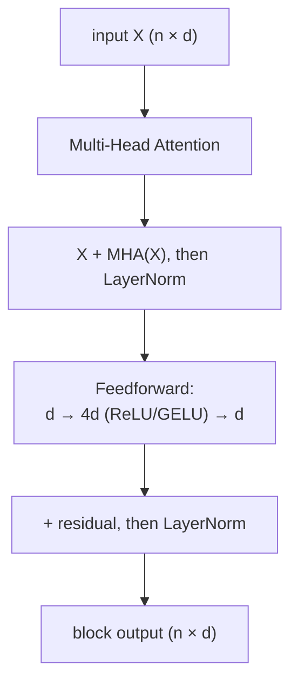

# The Transformer Block: Multi-Head Attention, Residuals, Norms, and Position

The [attention note](/posts/ml/2026-09-20-1-attention-turning-token-vectors-into-context) derived the single mechanism — softmax over query-key scores, times values — and ended with its two obvious weaknesses: one head can track only *one* relevance pattern at a time, and the whole operation is blind to token order.

This note turns attention into the actual Transformer block. The block is attention plus four supporting acts — multi-head projection, a residual connection, layer normalization, and a small feedforward network — and then positional encoding bolted onto the input. None of them are exotic. Each one exists to patch a specific failure of the bare mechanism, and by the end you should be able to name the patch for each failure.

We keep the same style: every mechanism shown with its shape and its purpose. No new gradient formulas — every one of these components is either linear, an addition, a per-coordinate mean/variance, or an activation you already know.

---

## 1. Multi-head attention: why one pattern isn't enough

Remember the constraint from the previous note: attention's similarity table is built from *one* set of projections $W_Q, W_K, W_V$. That one geometry has to handle every relationship language has — which tokens are the subject, which "it" refers back to, which word is the verb, which adjective modifies which noun, and thousands more. One dot-product geometry can only encode "similarity along one shared direction of meaning" at a time.

The fix is simultaneously dumb and perfect: **run attention $h$ times in parallel, with $h$ different projection matrices**, each operating on a *slice* of the model's dimension. If the model dimension is $d_{\text{model}} = 512$ and we use $h = 8$ heads, each head gets $d_k = d_v = 64$ — literally columns 0–63 of $XW_Q^{(1)}$, columns 64–127 of $W^{(2)}$, and so on. Each head is a complete, independent attention table:

$$
\text{head}^{(i)} = \operatorname{softmax}\!\left(\frac{XW_Q^{(i)} (XW_K^{(i)})^T}{\sqrt{d_k}}\right) XW_V^{(i)}, \qquad i = 1, \dots, h
$$

Then concatenate the eight $n \times 64$ outputs into one $n \times 512$ matrix and pass it through one final learned matrix $W_O$ of shape $(512, 512)$:

$$
\operatorname{MultiHead}(X) = \big[ \text{head}^{(1)} ; \text{head}^{(2)} ; \dots ; \text{head}^{(h)} \big] \, W_O
$$

Notice two properties before moving on:

- **Cost doesn't explode.** One $512 \to 512$ projection is eight $512 \to 64$ projections by parameter count; similarly for computing scores. Multi-head is the same parameter and FLOP budget carved up — nothing extra to pay for, just re-organized.
- **The subspaces can specialize.** Because each head lives in its own 64-dimensional slice, there's no geometric competition: head 1's slice can become the "subject-verb agreement" geometry while head 2's becomes the "pronoun resolution" geometry. Trained transformers' heads do in fact end up showing distinctly different attention patterns (syntax-tracking, position-tracking, delimiter-tracking), though never in the clean categories our labels would like.

**Intuition to keep:** one-head attention is a single "who-listens-to-whom" vote on one shared notion of relevance; multi-head is $h$ simultaneous votes, each with its own definition of relevance, merged afterward.

---

## 2. Residual connections: the gradient highway

A bare stack of many multi-head attention and feedforward stages — 24, 96 layers — would immediately run into the vanishing-gradients story from our activation-functions note: each layer's slope on the backward path multiplies. The Transformer survives only because of an architectural cheat:

$$
Y = X + \operatorname{SubLayer}(X)
$$

Formally, every sublayer (attention or feedforward) wraps itself: the *output is the sum of the input and the sublayer's transformation*.

Now follow the backward pass through it — this is one algebraic line but has oversized consequences. Let $Y = X + F(X)$. Then:

$$
\frac{\partial Y}{\partial X} = I + \frac{\partial F}{\partial X}
$$

The identity term is an **unimpeded slope-1 highway** through this layer. Even if the sublayer's derivative is terrible — near zero, saturated, dead — the input's signal can still pass straight through via the $I$, completely unharmed. Error arriving at a deep layer can chain these identity hops all the way back to the input with no multiplicative decay. This is why transformers can stack 96 blocks where plain 96-layer MLPs collapse.

Your ReLU-note realization ("ReLU's slope is exactly 1 on the active side — messages pass unaltered") is the same idea at smaller scale: residuals are ReLU's slope-preservation promoted from neuron level to layer level. The architecture is engineered around keeping slope-1 paths available *somewhere* for every gradient, always.

There's a second, subtler benefit: the sublayer no longer has to *preserve* anything it doesn't want to change. Without residuals, each layer must be trained to reconstruct-and-improve; with residuals, a layer can output a pure *correction* — it edits rather than rewrites. "What should I add to the current representation?" is a much easier question to learn than "re-express the entire representation, slightly better."

---

## 3. Layer normalization: keeping the numbers sane

Residuals have hidden cost: if every block **adds** onto the running representation, activations drift and grow as blocks stack up. Feed a drifting 500-dimensional vector through softmax, it saturates; statistics slide, and training gets brittle. You need something that resets the scale per token, per layer, without asking for a batch. That is LayerNorm.

For one token's vector $h$ of width $d$:

$$
\mu = \frac{1}{d}\sum_i h_i, \qquad \sigma^2 = \frac{1}{d}\sum_i (h_i - \mu)^2
$$
$$
\hat{h} = \frac{h - \mu}{\sqrt{\sigma^2 + \epsilon}} \odot \gamma + \beta
$$

with learned per-feature gain $\gamma$ and shift $\beta$. It standardizes each token's vector to mean 0 / variance 1, then lets training rescale and reshift it.

Three contrast points with BatchNorm, since that name comes up everywhere:

- LayerNorm normalizes **across features within a single token**. BatchNorm normalizes **across the batch for one feature**. LN's statistics are therefore independent of batch contents — a model sees the same normalization with a batch of 1 or 10,000, at training or inference. That consistency is precisely what sequence modeling needs (BN statistics flip between train and inference; LN's don't).
- $\gamma$ and $\beta$ mean normalization *isn't* constraining the model's expressiveness. If the model needs mean 3 / std 40, it learns exactly that. LN fixes scale *pathology*, not scale.
- Normalization shows up twice per block in modern transformers: $\text{Attention} \to \text{AddNorm}$, $\text{FFN} \to \text{AddNorm}$.

The block so far:



---

## 4. The feedforward network: nonlinear memory per token

After attention does the *routing* (who mixes with whom), each token's vector passes independently through a tiny two-layer MLP:

$$
\operatorname{FFN}(y) = W_2 \, \sigma(W_1 y + b_1) + b_2
$$

with widths $d \to 4d \to d$ (512 → 2048 → 512). Two things worth noticing in view of where we've been:

- **Same activation conversation as before.** Early transformers used ReLU; modern ones use GELU — the activation-function note's ending shows up straight away. The nonlinearity here is what lets the whole model stack compute more than linear maps — the reasoning from "linear layers collapse" applies inside the block too.
- **This is where "knowledge" tends to sit.** Attention moves information between tokens; the FFNs process it per token. Some mechanistic interpretability work reads the FFN as a soft key-value memory — first layer retrieves pattern-activated directions, second layer writes facts. Whether or not that story fully holds, "attention routes, FFN stores" is a decent rough partition of labor.

Position-independent: every token goes through the *same* $W_1, W_2$; FFN applies at each position separately. Attention is the only place where tokens talk.

---

## 5. Positional encoding: giving a set back its order

Section 5 of the previous note derived why attention is permutation equivariant: permute the input rows, and every score, weight, and output row permutes identically. Meaning has no visibility into order. A transformer with embeddings alone *provably* cannot distinguish "dog bites man" from "man bites dog", no matter how it's trained, because the two sequences only differ in order.

The patch: give each position a vector and **add it directly to the token's embedding** at the input:

$$
\tilde{x}_i = x_i + p_i
$$

Now content and position are entangled from layer 0 and attention's scores see both. The classic "Attention Is All You Need" choice is a fixed, deterministic function of position:

$$
\operatorname{PE}(\text{pos}, 2i) = \sin\!\left(\frac{\text{pos}}{10000^{2i / d}}\right), \qquad
\operatorname{PE}(\text{pos}, 2i+1) = \cos\!\left(\frac{\text{pos}}{10000^{2i / d}}\right)
$$

Sinusoids with geometrically increasing wavelengths. The one-paragraph why: think of an odometer / binary counter — each "digit" ticks at a different rate. High-frequency coordinates (small $i$) change fast (distinguish nearby positions); low-frequency ones change slowly (encode rough location). Combination ≈ a unique fingerprint of "position". Beyond fingerprints, the frequencies are chosen so "shift by $k$" is a *linear map* of the encoding — attention can learn relative offsets from queries and keys that read the fingerprints.

Modern variants you'll meet (one-line each): learned absolute position embeddings (train a position embedding matrix like a second embedding table); RoPE (rotate query/key vectors by a position-dependent angle — relative offsets emerge geometrically; common in current LLMs); ALiBi (just subtract a distance penalty from scores). All are answers to "attention doesn't know order; inject order."

---

## 6. Causal masking: how decoders can't peek

One more ingredient distinguishes text *generation* models from encoders. If a model's job is "given a prefix, predict the next token", then during training on the sentence "the cat sat", the position of "cat" would *see* the positions of both preceding and following words by default — including "sat", the very token it's supposed to predict there. That's leakage: the network could cheat by reading the answer.

The fix is to force every query position $i$ to look only at keys $j \leq i$: before softmax, overwrite the upper triangle of the score matrix with $-\infty$:

$$
\frac{QK^T}{\sqrt{d_k}} \;+\; M, \qquad
M_{ij} = \begin{cases} 0 & j \leq i \\ -\infty & j > i \end{cases}
$$

Softmax of $-\infty$ is 0 (exactly). Every row is now a probability distribution over "this token and everything before" — future positions simply carry no weight. Row $i$'s weighted sum therefore involves only values from positions $\leq i$. Mathematically there is **no path by which future information reaches a position's output** — one more case where "doesn't just discourage cheating, makes it impossible" is the reassuring framing.

This is the entire difference between "encoder-style" attention (BERT: full visibility, best for understanding) and "decoder-style" attention (GPT: causal mask, best for generation). The rest of the architecture is shared.

---

## 7. The full block and model, assembled

One Transformer decoder block, end to end, $n$ tokens and width $d_{\text{model}}$:

```text
input: H  (n × d_model), token-embedding + positional encoding already added

1. masked multi-head attention   A = MHA(H)                # n × d_model
2. residual + layernorm          H = LN(H + A)
3. feedforward (d → 4d → d)      F = FFN(H)
4. residual + layernorm          H = LN(H + F)
output: H (same shape; stack another identical block)
```

Then stack — GPT-2 small uses 12 of these; big models use dozens — and put a final linear "language model head" on top mapping $d_{\text{model}} \to V$ for next-token logits. The LM head, softmax trick, and training objective, end-to-end with real text, is the next note.

A couple of quick parameter-count checks to anchor sizes, all of which you can verify from shapes alone (this is a reasoning exercise, no arithmetic required yet): with $d_{\text{model}} = 512$ and 4 heads:

- $W_Q, W_K, W_V$ slice sizes: $512 \times 128$ each in that variant; queries/keys/values have to be re-merged by $W_O$: $512 \times 512$.
- FFN: $512 \times 2048$ and $2048 \times 512$.

The FFN carries about twice the parameters of the attention sublayer — consistent with "routes vs remembers" split.

---

## 8. Exercises — reasoning only

1. Residuals: in a block $X \to X + F(X)$, trace a gradient backward when $F$ is "perfectly dead" (zero derivative). What does the input get? Why is that the *minimal* information needed to train everything upstream of this block?
2. Suppose we multiply the input embeddings by a huge constant (say 30) before the model. Walk the pipeline (scores, softmax, LN, and eventually FFN) and explain whether and where that scale gets corrected. Which component saves you, and why does it?
3. One-head vs multi-head: if you *concatenate* 8 heads of 64 dims, the result is linear in each head's output. Prove that one big attention with a block-diagonal $W_V$ is the same as multi-head without enhancements, then explain which ingredient in the real multi-head recipe lets heads *combine* rather than merely *stack*.
4. Why is causal masking done by *adding* $-\infty$ to scores rather than zeroing out the attention weights after softmax? (Hint: think about the gradient.)
5. If I give the model relative-position information instead of absolute, can it still answer "which word is third?". What task would expose the difference between absolute and relative position encodings?
6. Argue why the FFN's widening ($d \to 4d$) is necessary by linking back to your linear-layers-collapse observation from the activation notes. What would two consecutive linear 512→512 layers without nonlinearity be equivalent to?
7. Consider a 2-token sequence at inference time. Describe the mask matrix and its effect row by row: which value vectors can token 1's final representation depend on? Which can token 2's?

---

## 9. What comes next

The block is fully mechanical: mask, attend, add & norm, FFN, add & norm, repeat. Nothing yet explains how this becomes *a language model* — where does the probability over the next token come from, what is the loss, why is teacher forcing legitimate, and why this setup specifically beat RNNs so thoroughly. That end-to-end training picture is the [next note](/posts/ml/2026-09-20-3-training-a-language-model-end-to-end).
