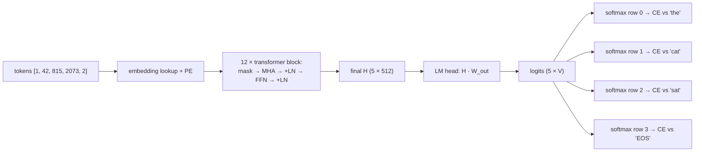

# Training a Language Model End to End: From Text to Loss to Generation

We now have every moving part: token → embedding (the lookup note), tokens mix via masked multi-head attention (previous two notes), blocks stack, and the whole thing is just a computation graph built from matrix multiplies and softmax — the exact family the general $L$-layer loop handles.

What remains is boring-sounding but is actually the point of the whole series: **how does a stack of transformer blocks become a language model that predicts text?** The answer has four pieces: a final linear layer to vocabulary-sized logits, cross-entropy per position against the next token, teacher forcing during training, and autoregressive sampling at inference. The pieces are individually simple; seeing them end-to-end is what makes "GPT" stop being magical.

The plan: walk one short sentence through the entire pipeline, name every tensor shape and every loss term, talk about *why* this setup trains so well (short gradient paths, parallelism), and then how the trained model is actually used to generate.

---

## 1. The full pipeline on one tiny sentence

Take the toy sentence (three tokens plus two special tokens — conventional but show them explicitly):

```text
<BOS>  the  cat  sat  <EOS>
```

At every position, the model predicts **the next token**. That's the whole objective; there is no other target. Watch what this implies when you work it through:

**Step 1: tokenize → IDs.** Tokens map to vocabulary indices. If vocab size $V = 50{,}000$, our sequence is a list of 5 integers, say `[1, 42, 815, 2073, 2]`.

**Step 2: embedding lookup + position.** Each ID indexes a row of the embedding matrix $E \in \mathbb{R}^{V \times d}$; add the position vector; get input $H^{(0)} \in \mathbb{R}^{5 \times d}$.

**Step 3: stack $N$ transformer blocks.** Shape stays $(5, d)$ the whole way through — the blocks' property is exactly "same shape out as in". Say $d = 512$, $N = 12$; interior shapes are all $(5, 512)$. Every position's representation now encodes everything causally visible to it.

**Step 4: language-model head.** Apply one final matrix $W_{\text{out}} \in \mathbb{R}^{d \times V}$ to each position's final vector:

$$
\text{Logits} = H^{(N)} W_{\text{out}} \quad\in\; \mathbb{R}^{5 \times V}
$$

Row $i$ is a 50,000-way score vector for "what token comes after position $i$". For row 1 (position of `the`), the model is effectively answering "what follows 'the'?"

**Step 5: next-token cross-entropy at every position.** Row $i$'s softmax is compared against the one-hot target for token $i+1$:

| position | prefix seen (causal) | target (next token) |
|---|---|---|
| 0 | `<BOS>` | `the` |
| 1 | `<BOS> the` | `cat` |
| 2 | `<BOS> the cat` | `sat` |
| 3 | `<BOS> the cat sat` | `<EOS>` |
| 4 | full sentence | — (nothing to predict; ignored) |

This is the entire loss:

$$
L = \frac{1}{4}\sum_{i=0}^{3} \operatorname{CE}\big(\text{row } i \text{ of Logits},\; \text{one-hot of token } i+1 \big)
$$

— and thanks to our softmax note's result, each individual cross-entropy collapses to $-\log p_{\text{correct next token}}$, and every position's gradient with respect to its logit row is just $p - y$. Everything else is the general backward loop.

One sentence of data, one forward pass, **four supervised predictions at once**. That's teacher forcing: we *show* the truth as input while asking for the next token. One 1024-token text yields 1023 training signals in a single pass.



### 1.1 Batching in practice: from one sequence to a 3D block

The walkthrough above used one sequence of length 5 for clarity. In training, you pack $B$ sequences of varying lengths into one tensor with shape:

$$
(B,\; n,\; d)
$$

where $B$ is the batch size, $n$ is the fixed maximum context length, and $d$ is the model width. Shorter sequences are padded up to length $n$ with a special `PAD` token, and the loss computation ignores the padded positions with a mask.

The attention score matrix therefore has shape $(B, n, n)$: for each of the $B$ examples, an $n \times n$ table of relevance scores. Softmax is applied **per example, per position**, so the competition between tokens is local to each sequence; padding positions just receive zero attention weight. This is the same "batch × context × d" 3D block you noted in the embeddings note, now with the sequence axis made explicit.

---

## 2. Why this trains so well

Before using it, appreciate *why* this combination historically displaced everything else:

**1. Every position is an example.** Language modeling didn't need labeled data like "sentiment" or "Q→A pairs"; raw text supervises itself. And each token position is another example, from the same forward pass, in parallel. The supervision ratio per FLOP is as high as it gets.

**2. Training is fully parallel.** Nothing about predicting token $i+1$ from prefix $\leq i$ requires computing positions in order — the masks make each position independent *during training*. GPUs get one giant set of same-time matrix operations, which has been the entire hidden theme of our GPU notes.

**3. Gradient paths are short.** Look at where loss at position 0 flows: the LM head, the stack, the residual highway all the way down, embeddings. Residuals keep slope-1 highways and attention keeps every pair of positions one hop apart. A signal from predicting position 0's target reaches token 0's embedding in O(N) hops — *independent of sequence length*. Compare RNNs, whose gradient for the last token must pass through every intermediate cell — path length grows with the sequence — and the vanishing gradient story returns from the activation note with enormous force. This architectural feature is not cosmetic; it *is* the reason deeper, wider models learned long-range dependencies at all.

**4. The objective is minimal and universal.** "Next token" forces the model to capture grammar (predicting "sat" after "cat" agent-verb agreement), facts ("the capital of France is ___"), style, coherence. Everything else — fine-tuning, instruction-tuning, RLHF — is downstream of or built on top of this loss.

---

## 3. Weight tying: use embeddings as the head

One detail worth knowing by name: the LM head matrix $W_{\text{out}}$ is conventionally *tied* to the input embedding matrix — literally $W_{\text{out}} = E^T$ (same parameters, transposed). Two reasons it's sensible rather than a hack:

1. **Same space argument**: the input embedding $E[i, :]$ lives in exactly the space the final representation $h$ lives in; reading the logit for token $i$ as $h \cdot E[i, :]$ is "how aligned is the model's prediction vector with token $i$'s vector?" — a natural measurement.
2. **Fewer parameters and better generalization**: a $V \times d$ matrix is often the single largest parameter block in the model (50,000 × 512 ≈ 26M for GPT-2 scale). Sharing it between input and output keeps it smaller *and* gives that matrix twice the gradient signal per step.

---

## 4. Generation: there is no teacher now

At inference time you sample from a model trained with teacher forcing. The loop:

```text
context = tokenize(prompt)
repeat:
    logits_row = model(context)[last position]     # shape (V,)
    next_token = sample(softmax(logits_row / T))   # temperature from the softmax note
    context    = context + [next_token]
until next_token = <EOS> or length limit
```

Two connections to earlier notes:

- **Temperature is right there.** Exactly our softmax temperature knob, applied per sampled token — the thing you annotated as "risk vs creativity" in the model's note. At $T = 0$ you'd take argmax and generation becomes deterministic-and-dry; at $T > 1$ it's uniform-ish and incoherent.
- **No parallelism anymore.** Each new token needs a full forward over the context so far. Training was one parallel batch over positions; generation is strictly a scan, token by token. This asymmetry — parallel training, serial generation — is why long prompts are fast to ingest and long completions are slow to emit. (The KV-cache from a later note is the optimization that keeps the serial pass tractable.)

There's also a subtle generalization gap by construction: during training the model *always* saw correct prefixes ("teaching forcing"), but during generation it sees *its own* earlier outputs, which include errors. Errors compound: a wrong token distorts the context the next prediction is conditional on. This is **exposure bias**; the fix-attempts for it (RL fine-tuning, scheduled sampling, instruction tuning at scale) live downstream, but seeing the gap clearly here sets up understanding why raw next-token LMs need further training to become assistants.

---

## 5. Zooming all the way out

Look at what the series just completed:

- **Vector/matrix forms** of the MLP layer (the NumPy note) generalize directly to the transformer's block-by-block computation graph.
- **Softmax and CE** are not just the classifier trick — they're the language model's loss, exactly, per position.
- **Embeddings** are the input *and* via weight tying the output axis-set. The progression you traced in the embeddings note — from fixed Word2Vec rows to BERT/GPT-style contextual vectors — is exactly what attention enables: static embedding in, context-dependent vector out.
- **Attention** is the single new algorithmic piece beyond "feedforward deep net" — the rest of the transformer is stability engineering (LN, residuals), order injection (PE), cheating prevention (mask), and a head.

The rough percentage intuition worth holding: the transformer was 80% the machinery you already had, 20% the content-routing idea. But the routing idea turned out to be the one that scales — what "attention buys you at infinite data and compute" is empirically enormous. That's now well-established lore, and every frontier model in 2024-2026 is a transformer stacked high.

The backward pass through all of this is, mechanically, exactly our $L$-layer loop; autograd's role is still just "record and walk." The conceptual jump is done.

---

## 6. Exercises — reasoning only

1. During training, position 1's target is `cat`; the input to position 1 is the *embedding of `the`*, not of `cat`. In one sentence each: why does this construction avoid trivial memorization ("the model sees the answer"), while still letting us use a full sentence per pass?
2. Teacher forcing + causal masking together let us train all positions in parallel. Explain precisely what information the mask blocks that would otherwise make training "too easy".
3. Exposure bias: why does a model that earned a tiny validation loss still sometimes produce incoherent long completions? Describe one concrete failure chain of three bad tokens.
4. Weight tying: consider a token whose embedding row has unusually *small* magnitude. How does that affect its probability of being produced at generation time even when its meaning is appropriate? Is this a bias, and if so, is it harmful or correcting?
5. Why does a $V \times d$ weight-tying scheme make rare-token improvement slow? (Think of how little gradient a rare token's embedding row receives via the embeddings-note row-update argument, on both the input *and* output side.)
6. Parallel training, serial generation: why can't you compute position $i$'s logits before knowing token $i-1$ at inference, even though you could at training? Name the architectural property responsible.
7. The model is asked at position 2 "what comes after 'cat'" — and it also uses its predicted `sat` (softly, via gradient) to shape position 2's representation. Why doesn't this circularity break training? (Draw the computational-graph direction: where does information actually flow and where does supervision act?)

---

## 7. What comes next

The training loop is complete; from here the natural next layers are: **KV caching** (the one inference optimization everyone talks about: never recompute keys/values of earlier tokens — straight from the attention formula), **decoding strategies** (top-k, top-p — wrapping the softmax temperature story with truncation), or **hands-on** — implement a small character-level transformer in NumPy/PyTorch and watch it learn your name. Happy to take whichever you want next; my default suggestion is KV cache, since it's the piece you run into first when reading real inference code.
